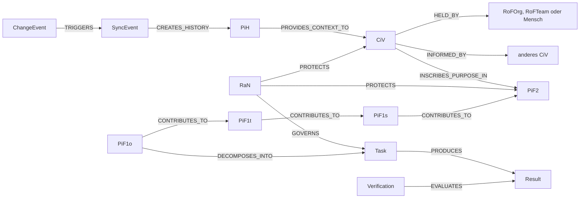

# JUNACO JCI Loop

🇩🇪 [Deutsch](#deutsch) · 🇬🇧 [English](#english)

## Deutsch

> Eine Organisation bleibt nur dann handlungsfähig, wenn Zweck, Zukunft, Verantwortung, Arbeit, Regeln, Umwelt und Lernen auch nach Veränderungen zusammenpassen.

Der **JUNACO Continuous Integration Loop** ist ein graphbasiertes Organisationsmodell. Er macht sichtbar, warum eine Aufgabe existiert, wer sie in welchem Team und welcher Rolle ausführt, welche Umweltobjekte benötigt werden, welche Regeln gelten, wie Erfolg geprüft wird und welcher frühere Zustand durch eine Änderung abgelöst wurde.

### Einstieg

- [Dokumentationsübersicht](docs/README.md)
- [Einführung für neue Leser](docs/guides/JCI_INTRODUCTION.md)
- [Die JCI-Elemente](docs/guides/JCI_ELEMENTS.md)
- [Durchgängiges Beispiel](docs/guides/JCI_EXAMPLE.md)
- [Kanonische Spezifikation](docs/JCI_CONTEXT.md)
- [Sechs Logikänderungen in Version 2.0](docs/changes/JCI_LOGIC_2_0.md)
- [Menschliche Freigabe und Eskalation](docs/changes/JCI_APPROVAL_1_0.md)

Die Regel-, Snapshot-, Werte- und Austauschprofile verwenden Version `2.0`. JSON-LD `1.1` und der bestehende Vokabularnamensraum bleiben unverändert. Die [Referenzfunktionen](reference/jci_rules.py) veranschaulichen prüfbare Regeln; sie bilden keine produktive SYNC-Engine.

Freigabepflichtige Vorgänge benötigen zusätzlich das ausdrücklich unterstützte Freigabeprofil `1.0`. Die [Freigabeprüfungen](reference/jci_approval.py) trennen menschliche Genehmigung, Zuständigkeit und erfolgreiche SYNC-Übernahme.

### Formale und technische Dokumente

- [Ontologie](docs/JCI_ONTOLOGY.md)
- [Graphregeln](docs/JCI_GRAPH_RULES.md)
- [SYNC-Spezifikation](docs/JCI_SYNC_SPEC.md)
- [Implementierungsleitfaden](docs/guides/JCI_IMPLEMENTATION_GUIDE.md)
- [Neo4j-Schema](docs/implementations/neo4j/JCI_NEO4J_SCHEMA.md)
- [Neo4j-Transaktionsadapter und Integrationstests](docs/implementations/neo4j/JCI_NEO4J_RUNTIME.md)
- [Maschinenlesbare Schemas](docs/schemas/)
- [Öffentliches JCI-Vokabular](docs/ns/jci/1.0/index.html)

## English

> An organisation remains viable only when purpose, future, responsibility, work, rules, environment, and learning continue to fit together after change.

The **JUNACO Continuous Integration Loop** is a graph-based organisational model. It makes it possible to trace why a task exists, who performs it in which team and role, which environmental objects are required, which rules apply, how success is verified, and which former state was superseded by a change.

### Start here

- [Documentation overview](docs/en/README.md)
- [Introduction](docs/en/guides/JCI_INTRODUCTION.md)
- [JCI elements](docs/en/guides/JCI_ELEMENTS.md)
- [End-to-end example](docs/en/guides/JCI_EXAMPLE.md)
- [English model specification](docs/en/JCI_CONTEXT.md)
- [Six logic changes in version 2.0](docs/en/changes/JCI_LOGIC_2_0.md)
- [Human approval and escalation](docs/en/changes/JCI_APPROVAL_1_0.md)

The rule, snapshot, value and exchange profiles use version `2.0`. JSON-LD `1.1` and the existing vocabulary namespace remain unchanged. The [reference functions](reference/jci_rules.py) illustrate testable rules; they do not form a production SYNC engine.

Approval-gated changes additionally require explicit support for approval profile `1.0`. The [approval checks](reference/jci_approval.py) separate human approval, accountability, and successful SYNC adoption.

### Formal and technical documents

- [Ontology](docs/en/JCI_ONTOLOGY.md)
- [Graph rules](docs/en/JCI_GRAPH_RULES.md)
- [SYNC specification](docs/en/JCI_SYNC_SPEC.md)
- [Implementation guide](docs/en/guides/JCI_IMPLEMENTATION_GUIDE.md)
- [Neo4j schema](docs/en/implementations/neo4j/JCI_NEO4J_SCHEMA.md)
- [Neo4j transaction adapter and integration tests](docs/en/implementations/neo4j/JCI_NEO4J_RUNTIME.md)
- [Machine-readable schemas](docs/schemas/)
- [Public JCI vocabulary](docs/ns/jci/1.0/index.html)

## Contribution and rights

- [Beitragen](CONTRIBUTING.md) · [Contributing](CONTRIBUTING.en.md)
- [Governance](GOVERNANCE.md) · [Governance in English](GOVERNANCE.en.md)
- [Lizenz](LICENSE.md) · [Informal English license translation](LICENSE.en.md)
- [Rechtehinweise](NOTICE.md) · [Rights notice in English](NOTICE.en.md)

The canonical German JCI model specification is licensed under **CC BY-NC-SA 4.0**. Commercial use generally requires a separate agreement with JUNACO Organisationsentwicklungs GmbH. Software and technical implementations require their own explicit software licence.
