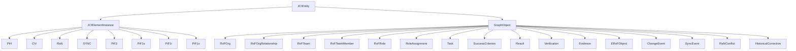
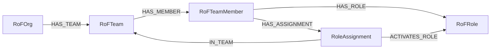
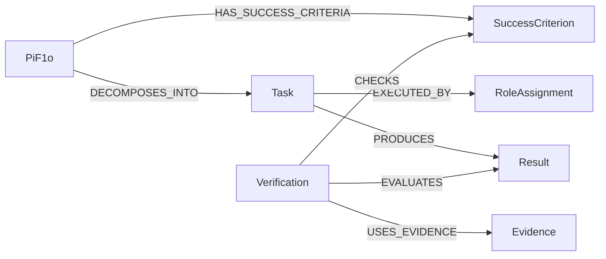
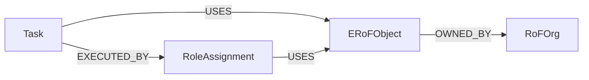

# Elements of the JCI Loop

[Documentation overview](../README.md) · [Deutsch](../../guides/JCI_ELEMENTS.md)

> This document is a controlled English translation. The canonical German specification remains authoritative.

## Ten core elements

| Element | Plain-language meaning |
|---|---|
| `PiH` | preserves a former state that was superseded |
| `CiV` | describes purpose and values |
| `RaN` | describes rules and norms |
| `RoF` | model space for organisations, teams, members, and roles |
| `ERoF` | model space for the relevant environment of acting roles |
| `SYNC` | stored definition of synchronisation logic |
| `PiF2` | long-term future state beyond ten years |
| `PiF1s` | strategic future state beyond five and up to ten years |
| `PiF1t` | tactical future state from one to five years |
| `PiF1o` | operational future state within one year |

`RoF` and `ERoF` are core elements without dedicated nodes. They become visible through their concrete graph objects and relationships.

## Stored entities

`JCIEntity` is the shared abstract supertype. Every stored entity has at least `id`, `entityType`, `name`, `createdAt`, `updatedAt`, `revision`, and `status`.

## Organisation and roles

A `RoleAssignment` means that a particular member activates an existing role in a particular team. The same person can therefore exercise the same role in several teams without duplicating the role or person.

## Work, result, and verification

- `Task`: What is done?
- `Result`: What was produced?
- `Evidence`: What supports the claim?
- `Verification`: How was the Result evaluated against a criterion?

## Environment

An active environmental object must be used by at least one role assignment. Ownership alone does not prove interaction. Internal or external status is derived relative to the organisation through `OWNED_BY`.

## Change objects

- `ChangeEvent`: reason and request for a change.
- `SyncEvent`: immutable result of a completed technical run.
- `PiH`: former state of an entity that actually changed.
- `RaNConflict`: a rule conflict that cannot be decided automatically.
- `HistoricalCorrection`: correction of a `PiH` without overwriting it.

The [canonical specification](../../JCI_CONTEXT.md) defines all required fields and cardinalities.

