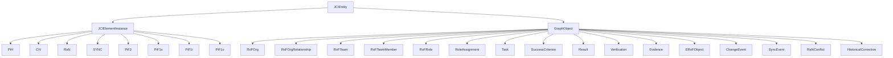
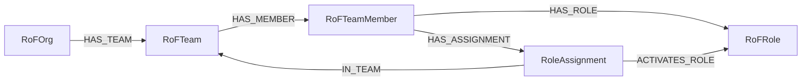
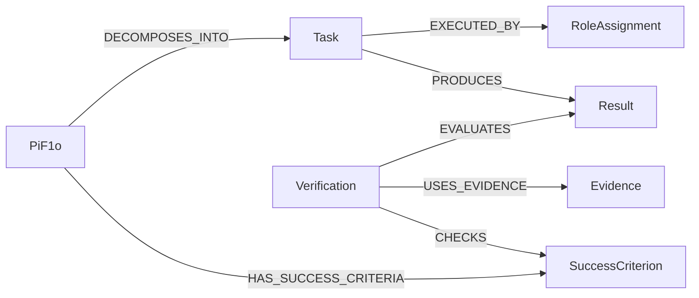
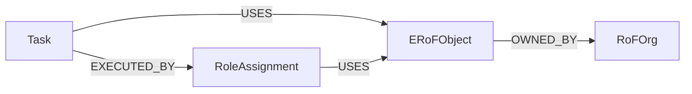

# Elements of the JCI Loop

[Documentation overview](../README.md) · [Deutsch](../../guides/JCI_ELEMENTS.md)

> This document is a controlled English translation. The canonical German specification remains authoritative.

## Ten core elements

| Element | Plain-language meaning |
|---|---|
| `PiH` | preserves a former state that was superseded |
| `CiV` | describes purpose and values |
| `RaN` | describes rules and norms |
| `RoF` | model space for organisations, teams, members, and roles |
| `ERoF` | model space for the relevant environment of acting roles |
| `SYNC` | stored definition of synchronisation logic |
| `PiF2` | long-term future state beyond ten years |
| `PiF1s` | strategic future state beyond five and up to ten years |
| `PiF1t` | tactical future state from one to five years |
| `PiF1o` | operational future state within one year |

`RoF` and `ERoF` are core elements without dedicated nodes. They become visible through their concrete graph objects and relationships.

## Stored entities



`JCIEntity` is the shared abstract supertype. Every stored entity has at least `id`, `entityType`, `name`, `createdAt`, `updatedAt`, `revision`, and `status`.

## Organisation and roles



A `RoleAssignment` means that a particular member activates an existing role in a particular team. The same person can therefore exercise the same role in several teams without duplicating the role or person.

### One-time initialisation

In a completely empty graph, no role assignment initially exists that could act as creator. A one-time atomic bootstrap may therefore create one `RoFOrg`, one `RoFTeam`, one technical `RoFTeamMember`, one `RoFRole`, exactly one `RoleAssignment` with `bootstrapKey = "ROOT"`, and one `SYNC` definition together. All six entities are created directly with `status = ACTIVE`, `revision = 1`, and the same `createdAt` and `updatedAt`; any `validFrom` values equal the same bootstrap timestamp. Only this root `RoleAssignment` may permanently exist without `CREATED_BY`; every other bootstrap entity points to it through `CREATED_BY`.

The bootstrap is permitted only for a completely empty graph. It creates no `ChangeEvent`, `SyncRun`, `SyncEvent`, or `PiH`. After successful completion, a second bootstrap and a second root `RoleAssignment` are prohibited. A data import is not a bootstrap.

## Work, result, and verification



- `Task`: What is done?
- `Result`: What was produced?
- `Evidence`: What supports the claim?
- `Verification`: How was the Result evaluated against a criterion?

A `Verification` records not only its relationships to exactly one `Result` and one `SuccessCriterion`, but also the revisions that were actually checked. For example, a verification with `evaluatedResultRevision = 3` and `checkedCriterionRevision = 2` remains applicable only while those exact revisions are current and the verification has not been superseded through `SUPERSEDES`. If either target changes later, the verification remains as evidence but is stale for the current state.

## Environment



An active environmental object must be used by at least one role assignment. Ownership alone does not prove interaction. Internal or external status is derived relative to the organisation through `OWNED_BY`.

### Example

The Task `Deploy customer portal` uses the `ERoFObject` `GitHub repository`. Anna performs the Task through her active `Developer` RoleAssignment and also uses this repository. The repository is owned by the observed `RoFOrg` and is therefore an internal environmental object from its perspective.

```text
Task: Deploy customer portal
  ├── EXECUTED_BY ──► RoleAssignment: Anna as Developer
  └── USES ─────────► ERoFObject: GitHub repository
                           ▲
RoleAssignment ── USES ────┘
ERoFObject ── OWNED_BY ──► RoFOrg: Example GmbH
```

If the repository were owned by a partner organisation, it would be an external environmental object from the perspective of Example GmbH. The determining factor is always the `OWNED_BY` relationship to the organisation being observed.

## Change objects

- `ChangeEvent`: reason and request for a change.
- `SyncEvent`: immutable result of a completed technical run.
- `PiH`: former state of an entity that actually changed.
- `RaNConflict`: a rule conflict that cannot be decided automatically.
- `HistoricalCorrection`: correction of a `PiH` without overwriting it.

An accepted `ChangeEvent` may initially have no `TRIGGERS` relationship: `TRIGGERS = 0` denotes the pending state before a technical attempt has ended. Every completed or controlled-aborted `SyncRun` creates exactly one immutable `SyncEvent` with its own unique `runId` and appends exactly one `TRIGGERS` relationship. A retry receives a new `runId` and its own `SyncEvent`.

`CHANGED_BY` and `AFFECTS` are therefore conditional:

- When an existing entity is changed, that entity points to the `ChangeEvent` through `CHANGED_BY`.
- For `CREATED`, no source entity exists before the successful commit. Only `SUCCESS` creates the new entity with `revision = 1`, `CREATED_BY`, and `CHANGED_BY`; no `PiH` is created. `CONFLICT` or `FAILED` creates neither the target node nor those relationships.
- A `SyncEvent` with `SUCCESS` or `CONFLICT` has at least one `AFFECTS` target. Only an early `FAILED` attempt that could not yet resolve the target may have no `AFFECTS` relationship.

A historical correction neither changes the `PiH` nor creates another `PiH`. Its `ChangeEvent` instead points through `TARGETS_HISTORY` to exactly the affected `PiH`. Before commit, `SYNC` compares the expected hash of the effective `HistoryView` with the current hash. Active corrections may affect only distinct `correctedFields`; an overlapping correction must fully supersede exactly one active predecessor through `SUPERSEDES`. Otherwise the attempt ends with `CONFLICT`.

The [canonical specification](../../JCI_CONTEXT.md) defines all required fields and cardinalities.

