# Complete JCI Example

[Documentation overview](../README.md) · [Deutsch](../../guides/JCI_EXAMPLE.md)

This example uses one scenario to cover all 24 concrete JCI entity types. It explains stored relationships, forward and backward navigation, and the `SUCCESS`, `CONFLICT`, and `FAILED` outcomes of a synchronisation attempt.

## 1. Reading relationships

A stored relationship is read from source to target:

```text
Source ── RELATIONSHIP ──► Target
```

`Task ── PRODUCES ──► Result` asks forward: “Which Result does this Task produce?” Backward navigation asks: “Which Task produced this Result?” The backward question does not create another stored edge.

| Stored direction                              | Forward question                     | Backward question                                 |
| --------------------------------------------- | ------------------------------------ | ------------------------------------------------- |
| `PiF1o ── DECOMPOSES_INTO ──► Task`           | Which Tasks realise the target?      | To which operational target does the Task belong? |
| `Task ── EXECUTED_BY ──► RoleAssignment`      | Which active role executes the Task? | Which Tasks does this role assignment execute?    |
| `Verification ── CHECKS ──► SuccessCriterion` | Which criterion is checked?          | Which Verifications evaluate this criterion?      |
| `SyncEvent ── CREATES_HISTORY ──► PiH`        | Which history did the run create?    | Which run created this `PiH`?                     |
| `ChangeEvent ── TARGETS_HISTORY ──► PiH`      | Which `PiH` is to be corrected?      | Which correction requests target this `PiH`?      |

## 2. Initial situation and purpose

Example GmbH wants to answer customer enquiries reliably. Earlier complaints about late responses provide historical context:

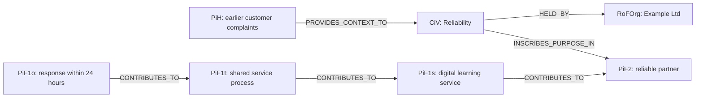

| Entity  | Example content                                                                                                                                                                      |
| ------- | ------------------------------------------------------------------------------------------------------------------------------------------------------------------------------------ |
| `PiH`   | Earlier complaints caused by late responses                                                                                                                                          |
| `CiV`   | Reliability: NOT = commitments have consequences; SELF = we fulfill commitments transparently; TO SERVE = customers receive dependable orientation. `HELD_BY` points to Example Ltd. |
| `PiF2`  | Customers experience the organisation as a reliable long-term partner.                                                                                                               |
| `PiF1s` | Customer service operates digitally and learns continuously.                                                                                                                         |
| `PiF1t` | All enquiry channels share one service process.                                                                                                                                      |
| `PiF1o` | Every enquiry receives a qualified response within 24 hours.                                                                                                                         |

Backward navigation from `PiF1o` reaches `CiV` and its historical context, explaining why the operational target exists.

### 2.1 Prerequisite: one-time bootstrap

Before this domain example can be created in a completely empty graph, the technical trust root is created exactly once:

```text
RoFOrg: Example GmbH
└── RoFTeam: Technical Administration
    └── RoFTeamMember: JCI System
        ├── RoFRole: JCI Administration
        └── RoleAssignment: JCI System as Administrator
            └── bootstrapKey = "ROOT"

SYNC: JCI standard process
```

These entities are created in one transaction with `status = ACTIVE`, `revision = 1`, and the same `createdAt` and `updatedAt`; any `validFrom` values equal the same bootstrap timestamp. Only the root `RoleAssignment` has no `CREATED_BY`; every other bootstrap entity points to that root `RoleAssignment`. The bootstrap creates no `ChangeEvent`, `SyncRun`, `SyncEvent`, or `PiH`. Only afterwards does the root `RoleAssignment` create this example's domain entities through regular `CREATED` requests. A second bootstrap is prohibited.

The technical root must not replace a human value decision. The first CiV and protection decisions require an explicitly authenticated initial authority for Anna, her active `RoleAssignment` subsequently created through the regular process, and the value holder Example GmbH. It applies only to `Model.action.CONFIRM`. Once a matching `VALUE_SCOPE` policy is activated, a durable disable latch turns off this initial authority; later policy revocation does not restore it. The used `SYNC.definition` explicitly supports `approvalProfileVersion = "1.0"` and `APPROVED_BY`.

## 3. Organisation, partnership, and roles

Example GmbH uses a platform operated by Service Cloud AG. Both remain independent organisations:

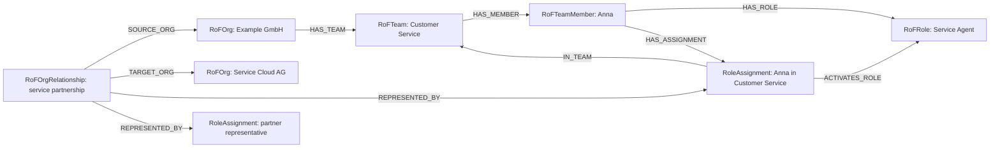

A second RoleAssignment from Service Cloud AG represents the partner side. `RoFOrgRelationship` connects organisations without merging their teams or roles.

Accountability, responsibility, and execution remain separate:

```text
PiF1o ── ACCOUNTABLE_MEMBER ──► RoFTeamMember: Anna
Task   ── RESPONSIBLE_TEAM ───► RoFTeam: Customer Service
Task   ── EXECUTED_BY ────────► RoleAssignment: Anna as Service Agent
```

## 4. Task hierarchy and work

The `PiF1o` is structured through one composite Task. Every Task belongs directly to this `PiF1o`; Task-to-Task relationships additionally form the hierarchy.

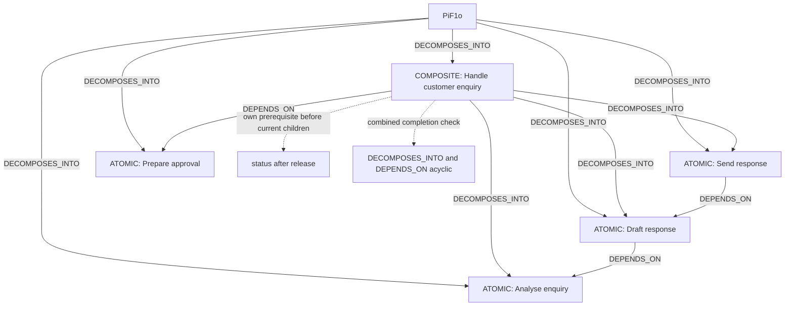

Only atomic Tasks carry `EXECUTED_BY`, `USES`, and `PRODUCES`. The released Composite first becomes `BLOCKED` when any of its own `DEPENDS_ON` prerequisites is unmet; otherwise its status is derived from current direct subtasks.

### 4.1 Replacement, release, and the combined completion graph

When `Create response` is replaced, the former Task remains connected to the `PiF1o` and receives `REPLACED`. Its explicitly connected successor counts in the current scope. `REVOKED` Tasks and withdrawn criteria are likewise excluded only after a confirmed scope change. The target requires at least one current Task and one current `REQUIRED` criterion; all current Tasks must be `COMPLETED` and all current mandatory criteria active and satisfied. Withdrawing a Composite does not remove its current descendants. An unresolved subtree produces `CONFLICT`.

If the Composite additionally needs the preparatory Task `Prepare approval` through `DEPENDS_ON`, it remains `BLOCKED` until that Task completes. This work step is not the human approval receipt in section 4.2. The prerequisite is not automatically inherited by every child. If only `DRAFT` children remain after a confirmed scope change, an already released Composite becomes `ACTIVE`. An unreleased draft cannot become directly `COMPLETED` by reducing scope.

If the Parent needs `Create response` to finish and that Task in turn needs the Parent through `DEPENDS_ON`, the calculated completion graph contains a cycle. `SYNC` rejects the request before adopting a partial change. All other Tasks are evaluated in the combined order of their completion prerequisites.

### 4.2 Release a Task with traceable approval

The Task `Send response` initially remains `DRAFT`. A technical requester assignment prepares its release. Anna is a `RoFTeamMember` with `memberType = HUMAN` and is accountable for the directly connected `PiF1o`; her active Service Agent assignment may approve only if a matching RaN explicitly grants that authority. An illustrative, human-confirmed policy is:

```text
RaN: Release atomic service work
  effect = PERMIT
  decisionKey = Task.action.RELEASE
  approvalPolicy.profileVersion = "1.0"
  approvalPolicy.mode = ACCOUNTABLE_CHAIN
  approvalPolicy.roleIds = [UUID of RoFRole Service Agent]
  approvalPolicy.levels = [PiF1o]
  condition = ALL(target.taskKind EQUALS ATOMIC)
  PROTECTS → CiV: Reliability
  PROTECTS → PiF2: reliable partner
  GOVERNS → Task: Send response
```

The [approval envelope](../../schemas/jci-approval-envelope.schema.json) binds the exact base request, including requester, target revision, and operations, through `requestHash`, and the checked roles, rules, and future paths through `contextHash`. Proposal and responses remain technical workflow data outside the domain graph until approval is complete. A trusted verifier establishes that Anna confirmed exactly this content. The immutable receipt includes `receiptId`, `decidedAt`, `validUntil`, `outcome`, `roleAssignmentId`, `memberId`, both hashes, and `attestation`; a claimed approval alone is insufficient.

After acceptance, requester and approver remain separately visible:

```text
ChangeEvent ── REQUESTED_BY ──► technical requester assignment
ChangeEvent ── APPROVED_BY ──► RoleAssignment: Anna as Service Agent
```

`APPROVED_BY` carries `receiptId`, `decidedAt`, `requestHash`, and `approvalHash`. The edge belongs exclusively to the `ChangeEvent` created at acceptance, remains immutable, and does not change Anna's assignment revision. Missing or rejected approval creates neither a released Task nor an accepted change event. Complete acceptance schedules the first `SyncRun`; `SYNC` rechecks receipts, authority, temporal validity, and every other model condition under the commit gate.

If `Create response` is not yet `COMPLETED`, confirmed release of `Send response` produces `BLOCKED` after `SUCCESS`. Only satisfied prerequisites permit `ACTIVE`. Approval means neither a sent response nor `COMPLETED` or `PiF1o.ACHIEVED`; results and Verification remain separately required wherever the existing completion rules require them. Approval also grants no additional access rights to the ticket system or service API.

When only Anna's authority is missing, the request may proceed to the explicitly assigned accountability of `PiF1t`, then `PiF1s`, and finally `PiF2`. Each permits `ACCOUNTABLE_MEMBER = 0..1`; a required assignment must not be missing. `PiF1o` retains exactly `1`. Every current contribution branch must be considered up to its first authorized anchor, even with `contributionMode = ANY`. An effective `DENY`, `UNEVALUABLE`, or Anna's explicit rejection must not be bypassed through a higher level.

A later change to the CiV or selected `PROTECTS` relationships instead uses `Model.action.CONFIRM` with `approvalPolicy.mode = VALUE_SCOPE`. The policy governs the human `RoleAssignment` and explicitly covers the affected value holder through its protected CiV/PiF2. Moving an organisational value to a team requires confirmation for both old and new holders; a global organisational policy does not automatically authorize team-value decisions. Previously valid policies authorize the change, not authority newly introduced in the candidate. See the [implementation guide](JCI_IMPLEMENTATION_GUIDE.md) for details and limits.

## 5. Environment

Anna and the Task use internal and external environmental objects:

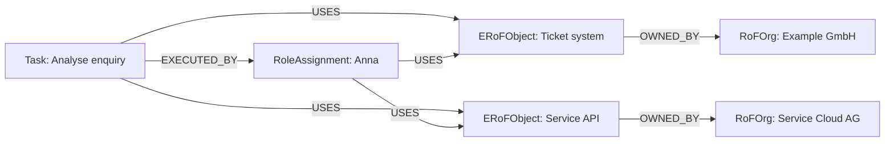

The ticket system is internal relative to Example GmbH. The service API is external because the partner owns it. `OWNED_BY` determines this perspective; only `USES` proves actual interaction.

## 6. Success, Result, and Verification

The operational state has a required numeric criterion:

```text
SuccessCriterion
├── measurementType = NUMERIC
├── operator = LESS_OR_EQUAL
├── targetValue = 24
├── unit = hours
└── requirementLevel = REQUIRED
```

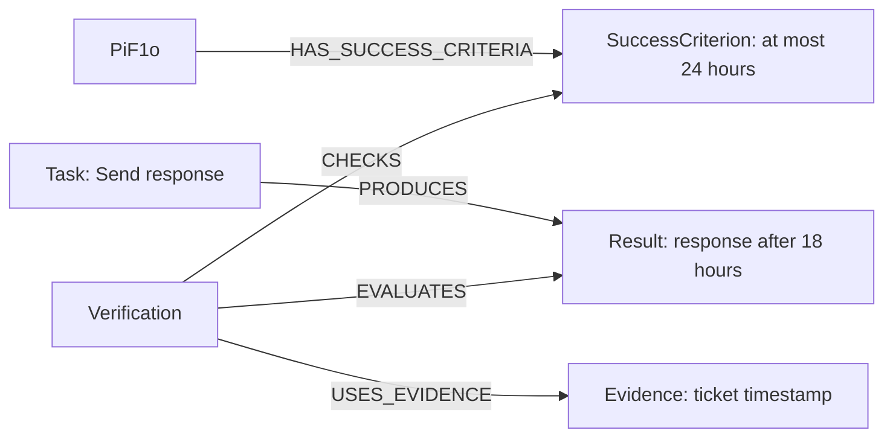

Because 18 is less than or equal to 24, the complete `Verification` is recorded with the domain result `VALID`. Assume that the checked `Result` has `revision = 3` and the checked `SuccessCriterion` has `revision = 2`; the verification additionally stores:

```text
Verification
├── evaluatedResultRevision = 3
└── checkedCriterionRevision = 2
```

The `Verification` is applicable only while it has not been superseded and the current revisions of both targets still match these bound revisions. If the criterion is later changed to twelve hours and thereby reaches revision 3, the earlier verification remains immutable but is stale for the new target state. A new verification binds the current target revisions and may point to the earlier `Verification` through `SUPERSEDES`.

Creating `EVALUATES` and `CHECKS` does not change the checked target revisions. The new verification therefore remains applicable after commit. The same applies to new Evidence and supersession references. Current target achievement uses only Results from currently considered Tasks; reusing earlier work requires an explicit decision, a current Result, and traceable evidence. A PiF1o that has already become `ACHIEVED` is not reopened.

## 7. RaN types and structure

`RaN` is an entity type. `RULE`, `NORM`, `POLICY`, `CONSTRAINT`, and `LAW` are values of its `ruleType` property, not additional nodes.

| `ruleType`   | Example                                      |
| ------------ | -------------------------------------------- |
| `RULE`       | Every enquiry requires a category.           |
| `NORM`       | Responses use the approved template.         |
| `POLICY`     | Only authorised roles may use customer data. |
| `CONSTRAINT` | Responses must be sent within 24 hours.      |
| `LAW`        | Personal data must be processed lawfully.    |

Every `RaN` also carries `effect = REQUIRE | PROHIBIT | PERMIT`, `scopeType = GLOBAL | ORGANIZATION | TEAM | ENTITY`, `decisionKey`, `governedTypes`, `priority`, and a normalised `condition` with `combiner = ALL | ANY`.

An active `RaN` protects at least one `CiV` and at least one `PiF2` grounded by it through `PROTECTS`. `GOVERNS`, in contrast, connects the concrete implementation on which the condition is evaluated. In this example, the access rule protects the CiV “Reliability” and the long-term future “reliable partner”.

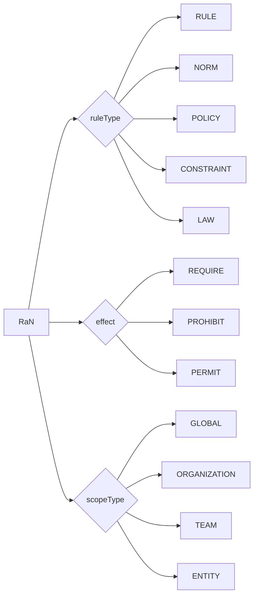

The arrows in this type diagram illustrate properties and are not stored JCI relationships.

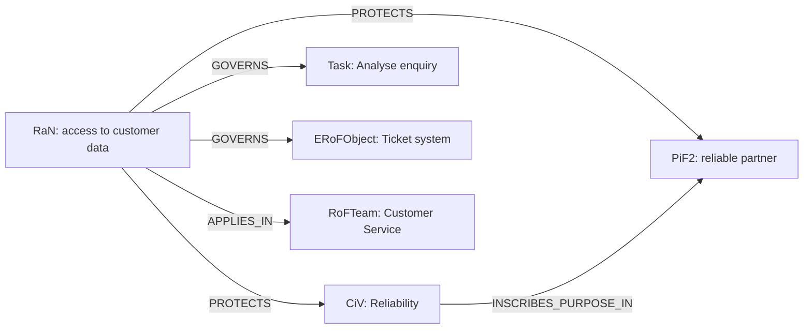

Condition clauses exclusively use `EXISTS`, `NOT_EXISTS`, `EQUALS`, `NOT_EQUALS`, `LESS_THAN`, `LESS_OR_EQUAL`, `GREATER_THAN`, `GREATER_OR_EQUAL`, `IN`, `NOT_IN`, `CONTAINS`, or `MATCHES`.

| `effect`   | Condition true | Condition false |
| ---------- | -------------- | --------------- |
| `REQUIRE`  | `ALLOW`        | `DENY`          |
| `PROHIBIT` | `DENY`         | `NO_DECISION`   |
| `PERMIT`   | `ALLOW`        | `NO_DECISION`   |

One `DENY` blocks the decision but is not yet a `RaNConflict`.

## 8. RaNConflict and resolution

Two rules govern the same deletion decision:

- `RaN A`: Delete customer data after 30 days.
- `RaN B`: Retain complaint data for at least 90 days.

If both apply at the same highest priority, they create a `PRIORITY_TIE`:

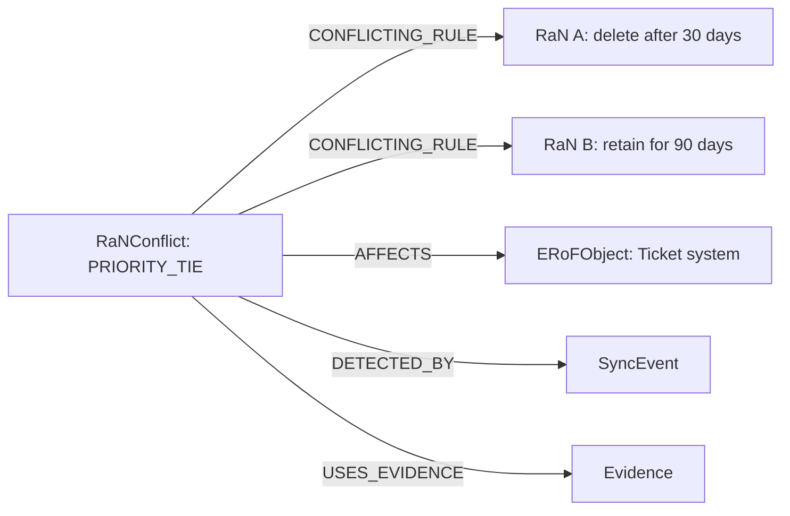

`UNEVALUABLE` is the second conflict type and may involve only one rule that cannot be evaluated unambiguously. `PRIORITY_TIE` requires at least two `CONFLICTING_RULE` edges. Only an explicit domain change followed by a successful run may move the conflict from `OPEN` to `RESOLVED`; its former open state becomes a `PiH`.

The subsequently resolved state additionally carries:

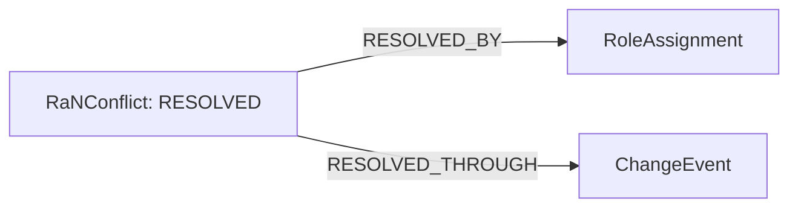

## 9. Change and SYNC

The response target is later tightened from 24 to 12 hours. In this example the `PiF1o` is still `ACTIVE`. Anna requests its change; an already achieved target would require a new future entity:

```text
PiF1o      ── CHANGED_BY ───► ChangeEvent
ChangeEvent ── REQUESTED_BY ──► RoleAssignment: Anna
```

Because the target node already exists, it points through `CHANGED_BY` to the accepted `ChangeEvent`. Immediately after acceptance, this event may still have `TRIGGERS = 0`: the request is then waiting for its first technical attempt to finish.

`SYNC` is the stored and historisable process definition. `SyncRun` is mutable technical runtime state and not a graph node. Every attempt has a unique `runId`. `SyncEvent` is stored immutably only after completion or controlled termination.

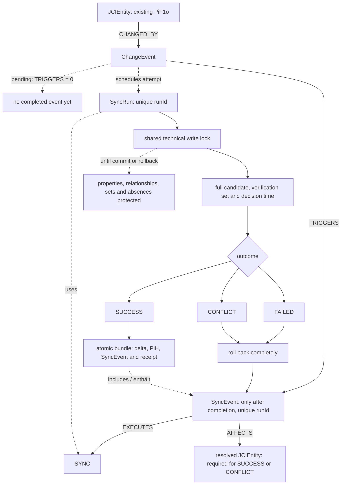

Dashed arrows are technical process steps, not stored relationships. Every completed or controlled-aborted attempt creates exactly one `SyncEvent` with the same `runId` as its `SyncRun`. A retry creates a new `runId`, a new `SyncEvent`, and another append-only `TRIGGERS` relationship.

Before the final decision, a shared technical write lock protects the model store across all participating organizations. `SYNC` rereads rules, roles, the verification set, relationships, and absences under this lock. A server-side domain decision time determines the temporal validity being checked. Two concurrent requests must neither jointly create a completion cycle nor adopt the same stale verification set. A mere event reference does not increment the referenced SYNC definition or entity revision.

## 10. The three SYNC outcomes

| Outcome    | Domain change                    | Revision and `PiH`                              | Completion documentation                                                                                              |
| ---------- | -------------------------------- | ----------------------------------------------- | --------------------------------------------------------------------------------------------------------------------- |
| `SUCCESS`  | commit completely and atomically | for every existing entity that actually changes | `SyncEvent`; at least one `AFFECTS` target                                                                            |
| `CONFLICT` | roll back completely             | none for rejected states                        | `SyncEvent`; at least one `AFFECTS` target, optionally `RaNConflict`                                                  |
| `FAILED`   | roll back completely             | none for rejected states                        | `SyncEvent` immediately or after technical recovery; `AFFECTS` may be absent only before successful target resolution |

The completed event records the definition used and affected entities:

```text
ChangeEvent ── TRIGGERS ──► SyncEvent: only after completion, unique `runId`
SyncEvent ── EXECUTES ─────► SYNC
SyncEvent ── AFFECTS ──────► JCIEntity
```

On `SUCCESS`, only states that were actually superseded are historised:

```text
PiF1o    ── HAS_HISTORICAL_STATE ──► PiH: PiF1o revision 3
SyncEvent ── CREATES_HISTORY ───────► PiH: PiF1o revision 3
```

If the `SuccessCriterion` also changes, it receives its own `PiH`. A Task that was only evaluated but remained unchanged receives no history.

Initial entity creation uses different provenance. For a `ChangeEvent` with `changeType = CREATED`, no target node and therefore no `CHANGED_BY` source exists before the successful commit. On `SUCCESS`, the new node with `revision = 1`, its `CREATED_BY`, and exactly one `CHANGED_BY` relationship are created together; no `PiH` exists because there was no predecessor state. On `CONFLICT` or `FAILED`, the target node, `CHANGED_BY`, and history remain absent.

## 11. HistoricalCorrection

An error in an existing `PiH` is never corrected by overwriting it:

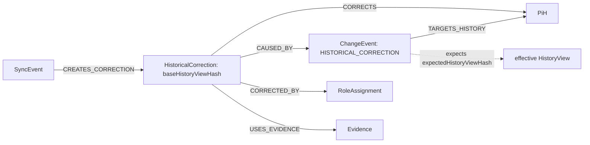

Before commit, `SYNC` calculates the effective `HistoryView` from the immutable `PiH` and its active corrections. Only if its current hash equals the request's `expectedHistoryViewHash` may the new correction be created with the same value as `baseHistoryViewHash`. Processing is serialized per `PiH`; a stale hash produces `CONFLICT` and no correction.

Two active `HistoricalCorrections` for the same `PiH` may coexist when their `correctedFields` are disjoint, for example `/stateData/properties/name` and `/relationshipData/INCOMING:HAS_MEMBER:00000000-0000-0000-0000-000000000007/properties/validUntil`. If fields overlap, the new correction must fully replace exactly one active predecessor through `SUPERSEDES` and repeat every value that remains valid. Ambiguous or multiple overlaps produce `CONFLICT`. The original `PiH` and every correction remain immutable.

Correction profile 2.0 checks overlap on decoded JSON-Pointer segments: a whole relationship and one of its properties overlap; `name` and `nameLong` do not. Array indices and paths inside a TypedValue are prohibited. `ADDITION` requires an absent path; an existing `NULL` value is not absent. `previousValue` is checked against the effective view at that time. Later, the absolute `correctedValue` values of non-superseded corrections overlay the original. Older profiles receive their own resolvers; existing PiH and hashes remain unchanged.

## 12. Complete traceability

| Perspective           | Path or question                                                                                                       |
| --------------------- | ---------------------------------------------------------------------------------------------------------------------- |
| **WHY**               | From `Task` through `PiF1o`, `PiF1t`, `PiF1s`, and `PiF2` to `CiV`: Why does the work exist?                           |
| **WHO**               | From `Task` through `RoleAssignment`, `RoFTeamMember`, `RoFRole`, `RoFTeam`, and `RoFOrg`: Who acts in which context?  |
| **WHERE**             | From `Task` and `RoleAssignment` through `USES` to `ERoFObject` and its `OWNED_BY`: Which environment is used?         |
| **UNDER WHICH RULES** | Backward from a target to `RaN` nodes connected through `GOVERNS`: Which rules apply?                                  |
| **WITH WHAT RESULT**  | From `Task` to `Result`, `Verification`, `SuccessCriterion`, and `Evidence`: What was produced and how was it checked? |
| **WITH WHAT HISTORY** | From `JCIEntity` and `SyncEvent` to `PiH` and `HistoricalCorrection`: Which former states and corrections exist?       |

## 13. Coverage of all concrete entities

The complete map shows every concrete entity type at least once. It summarizes possible relationships; conditional edges such as `CHANGED_BY`, `TARGETS_HISTORY`, and `AFFECTS` need not occur together in the same change process. Detailed rules and cardinalities remain documented in the smaller diagrams above and in the canonical specification.

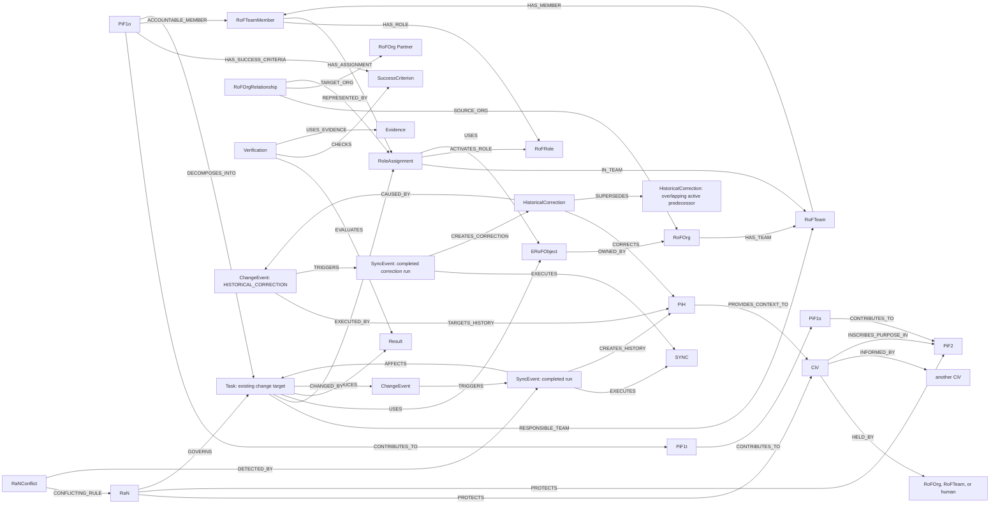

| Area                   | Entities                                                                                |
| ---------------------- | --------------------------------------------------------------------------------------- |
| Core-element instances | `PiH`, `CiV`, `RaN`, `SYNC`, `PiF2`, `PiF1s`, `PiF1t`, `PiF1o`                          |
| Organisation           | `RoFOrg`, `RoFOrgRelationship`, `RoFTeam`, `RoFTeamMember`, `RoFRole`, `RoleAssignment` |
| Work and verification  | `Task`, `SuccessCriterion`, `Result`, `Verification`, `Evidence`, `ERoFObject`          |
| Change                 | `ChangeEvent`, `SyncEvent`, `RaNConflict`, `HistoricalCorrection`                       |

`JCIEntity`, `JCIElementInstance`, and `GraphObject` are abstract types. `RoF` and `ERoF` are model spaces. `SyncRun` is technical runtime state. They are not counted as additional domain nodes.
