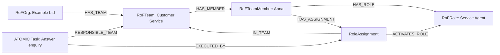
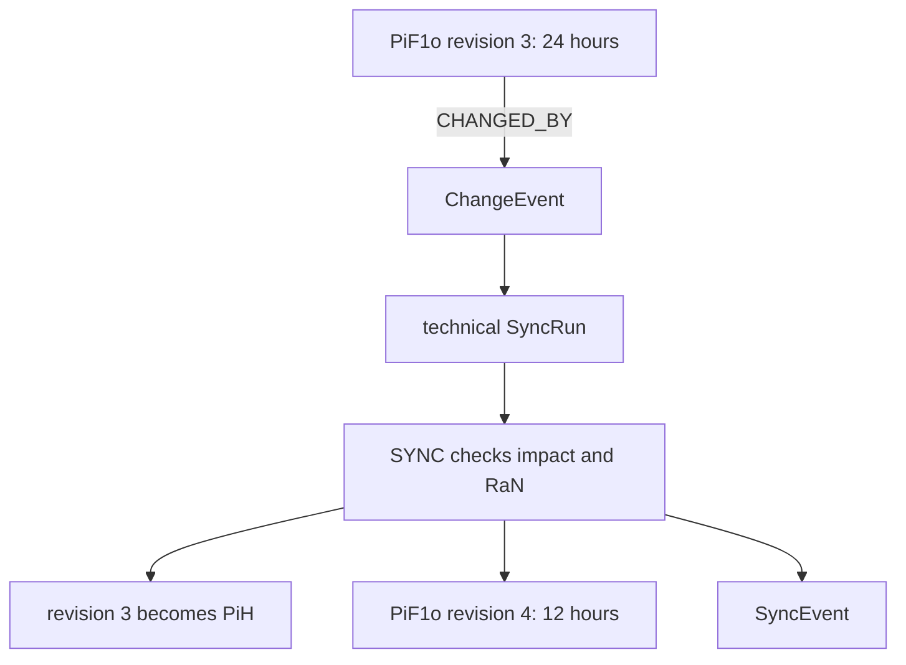

# End-to-end JCI example

[Documentation overview](../README.md) · [Deutsch](../../guides/JCI_EXAMPLE.md)

> This document is a controlled English translation. The canonical German specification remains authoritative.

## Starting point

An organisation wants to answer customer enquiries reliably within 24 hours.

## 1. Purpose and future

```text
CiV   = We act with customer focus and reliability.
PiF2  = Customers experience the organisation as a reliable long-term partner.
PiF1s = Customer service operates digitally and continuously learns.
PiF1t = All enquiry channels are connected in one service process.
PiF1o = Every customer enquiry receives a qualified response within 24 hours.
```

The future elements are connected from the more concrete to the more general state through `CONTRIBUTES_TO`. `CiV` inscribes purpose in `PiF2` through `INSCRIBES_PURPOSE_IN`.

## 2. Success and accountability

```text
SuccessCriterion
├── measurementType = NUMERIC
├── operator = LESS_OR_EQUAL
├── targetValue = 24
└── unit = hours

PiF1o ── ACCOUNTABLE_MEMBER ──► RoFTeamMember: Anna
```

Anna is accountable for the operational state, but does not need to execute every Task herself.

## 3. Team, role, and work



A composite Task can structure analysis, response, and quality control. Only atomic Tasks are executed directly.

## 4. Environment

The executing `RoleAssignment` uses a ticket system and a knowledge base. The Task uses the same `ERoFObjects`, so every environmental interaction remains connected to an acting role in a team.

## 5. Result and verification

The Task produces a `Result` containing the response time and response reference. A `Verification` evaluates that Result against the `SuccessCriterion` and may use `Evidence` from the ticket system.

Only when all required criteria have current valid Verifications, all Tasks are completed, and all dependencies are satisfied may `SYNC` set the `PiF1o` to `ACHIEVED`.

## 6. Rule

A `RaN` requires personal customer data to be used only by authorised roles. `SYNC` checks the rule before a change. A single violation yields `DENY`; only contradictory applicable rules about the same decision can form a `RaNConflict`.

## 7. Change and history

The target is later tightened from 24 to 12 hours:



Affected entities are checked. Only entities that actually change receive a new revision and their own `PiH`. The final `SyncEvent` documents the attempt.

## Traceability

The Task now answers:

- **WHY:** Which `PiF1o`, future context, and `CiV` does it serve?
- **WHO:** Which RoleAssignment, member, team, and organisation execute it?
- **WHERE:** Which `ERoFObjects` are used?
- **UNDER WHICH RULES:** Which `RaN` apply?
- **WITH WHAT HISTORY:** Which former states exist as `PiH`?

