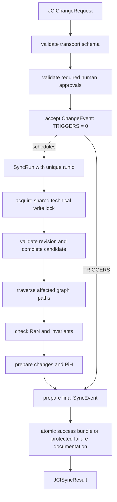

# JCI implementation guide

[Documentation overview](../README.md) · [Deutsch](../../guides/JCI_IMPLEMENTATION_GUIDE.md)

> This document is a controlled English translation. The canonical German specification remains authoritative.

## Purpose

This guide orders the implementation steps. [`JCI_CONTEXT.md`](../JCI_CONTEXT.md), [`JCI_ONTOLOGY.md`](../JCI_ONTOLOGY.md), [`JCI_GRAPH_RULES.md`](../JCI_GRAPH_RULES.md), and [`JCI_SYNC_SPEC.md`](../JCI_SYNC_SPEC.md) remain normative.

## 1. Run the one-time bootstrap

The bootstrap is intended only for a completely empty graph. One atomic transaction creates one `RoFOrg`, one `RoFTeam`, one technical `RoFTeamMember`, one `RoFRole`, exactly one root `RoleAssignment` with `bootstrapKey = "ROOT"`, and one `SYNC` definition. All six entities directly receive `status = ACTIVE`, `revision = 1`, and the same value for `createdAt` and `updatedAt`; any `validFrom` values equal the same bootstrap timestamp. Only the root `RoleAssignment` may exist without `CREATED_BY`; every other bootstrap entity points to it through `CREATED_BY`.

Before commit, validate the empty starting graph, completeness of the minimal graph, and uniqueness of `bootstrapKey = "ROOT"`. On any error, roll everything back. The bootstrap creates no `ChangeEvent`, `SyncRun`, `SyncEvent`, or `PiH`; after a successful commit, repetition and a second root `RoleAssignment` are prohibited. An import is not a bootstrap and later uses the regular SYNC process.

## 2. Store entities

Every node receives the abstract type `JCIEntity` and exactly one concrete `entityType`. Common required properties are UUID, name, timestamps, positive revision, and a type-appropriate status. Newly created entities begin with `revision = 1`. `RoF` and `ERoF` are not stored as dedicated nodes.

A `CiV` stores exactly one value with the required properties `notCiV`, `selfCiV`, and `toServeCiV`. Its scope is exclusively the single `HELD_BY` relationship to `RoFOrg`, `RoFTeam`, or a human `RoFTeamMember`; `purpose`, `values`, and `scope` are not stored on CiV. `INFORMED_BY` documents only explicitly confirmed provenance. All CiV directly grounding one `PiF2` must have the same value holder.

A `Verification` additionally stores `evaluatedResultRevision` and `checkedCriterionRevision`. It is applicable only if it has not been superseded and both bound revisions equal the current revisions of its `Result` and `SuccessCriterion`. For example, if a criterion changes from revision 2 to 3, a verification bound to revision 2 no longer contributes to current target achievement.

## 3. Validate relationships

Only canonical relationship types are permitted. Before activation, validate direction, endpoint types, cardinalities, temporal validity, and additional invariants. Inverse readings do not create duplicate edges.

An active `RaN` has at least one `PROTECTS` to `CiV`, at least one `PROTECTS` to a `PiF2` grounded by that CiV, and at least one `GOVERNS` to a permitted implementation element. Permitted implementation types cover the future levels `PiF1s` through `PiF1o`, work, success and verification, organization, roles, and environment. `PiF2` is not a `GOVERNS` target. Protection relationships are stored only after human confirmation and are not inferred by `SYNC`.

To migrate an existing `GOVERNS` edge to `PiF2`, first prepare a `PROTECTS` candidate to that PiF2. An authorized `RoleAssignment` confirms at least one CiV connected to that PiF2 as protected as well and connects concrete implementation elements through `GOVERNS`. Remove the former edge only after successful SYNC validation. Automatic CiV selection is prohibited.

### 3.1 State ownership and current sets

The versioned relationship catalog determines which endpoint is changed in each relationship context. New `EVALUATES`, `CHECKS`, `USES_EVIDENCE`, and `SUPERSEDES` references from a Verification do not change their referenced targets. New event and history references likewise do not increment a merely referenced domain entity. Actual changes to the assigned domain state produce exactly one revision and one PiH per existing mutable entity. Unclassified relationships are not assumed to be revision-neutral.

PiF1o evaluation excludes Tasks and criteria in `REPLACED` or `REVOKED` from the current scope while retaining their stored provenance relationships. `COMPLETED` still counts. At least one current Task and one current `REQUIRED` criterion are required. Withdrawals, successors, and descendants need a confirmed valid scope; old `DEPENDS_ON` references are not automatically redirected. Results from Tasks no longer considered do not silently count toward target achievement.

### 3.2 Combined completion evaluation

An unmet prerequisite of a released Composite takes precedence and yields `BLOCKED`. Its current child scope is evaluated afterwards. With only `DRAFT` children remaining, a released Composite stays `ACTIVE`; `DRAFT` first requires regular release and does not become directly `COMPLETED` through scope reduction.

Before this evaluation, a combined completion graph is built from Composite-to-child and `DEPENDS_ON` dependencies. A mixed cycle produces `CONFLICT`. Prerequisites are processed first, interleaving atomic and composite Tasks. Current mandatory criteria, target achievement, and higher future contributions are evaluated afterwards.

### 3.3 Implement human approvals

Protected operations additionally use `approvalProfileVersion = "1.0"`. The stored `SYNC.definition` must explicitly support this profile, include `APPROVED_BY` in its relationship catalog, and bind the matching validator through its package checksum. The base request and canonical hash profile remain `2.0`; an older handler must not ignore the additional profile.

`ACCOUNTABLE_MEMBER` remains exactly `1` for `PiF1o`; it is `0..1` on each `PiF1t`, `PiF1s`, and `PiF2`. An approval level actually required by the route must have an unambiguous assignment. Accountability, `CONTRIBUTES_TO`, and role names confer no authority. Authority requires an active, temporally valid, scope-compatible `PERMIT` RaN with matching `condition`, `decisionKey`, and the optional structured field:

```text
approvalPolicy = {
  profileVersion: "1.0",
  mode: ACCOUNTABLE_CHAIN | VALUE_SCOPE,
  roleIds: nonempty, unique list of RoFRole UUIDs,
  levels: for ACCOUNTABLE_CHAIN, a nonempty list from PiF1o, PiF1t, PiF1s, PiF2;
          absent or empty for VALUE_SCOPE
}
```

For `Task.action.RELEASE`, `ACCOUNTABLE_CHAIN` starts at the directly associated `PiF1o`. When only authority is missing, follow every current contribution branch to its first authorized accountability, no further than `PiF2`. All required anchors must approve, independently of `contributionMode`. Missing assignments, `UNEVALUABLE`, effective `DENY`, and human rejection do not permit skipping levels or switching roles to bypass the decision.

For `Model.action.CONFIRM`, `VALUE_SCOPE` checks every affected old and new value holder when values, provenance, purpose links, protection, policy, or accountability change. The granting policy must cover that holder through its protected CiV/PiF2; `GLOBAL` does not broaden this mandate. The role operand, actor membership, and `APPLIES_IN` also apply. Evaluation uses the governed `RoleAssignment`, not a new `GOVERNS` link to `CiV` or `PiF2`. Authority must exist before the change; a candidate cannot authorize itself.

The [approval envelope](../../schemas/jci-approval-envelope.schema.json) contains the unchanged `proposal`, `decisionKey`, `requestHash`, `contextHash`, and `receipts`. Proposals and rejected receipts remain durable technical workflow state outside `JCIEntity`. A trusted integration must establish the authenticated requester assignment and the consenting human behind `memberId` and `roleAssignmentId`. Each receipt binds the exact request, context, and validity interval; a self-declared confirmation variable is not evidence.

Only complete approval creates the accepted `ChangeEvent` with its unchanged `REQUESTED_BY` and source-owned `APPROVED_BY` edges. Each edge carries `receiptId`, `decidedAt`, `requestHash`, and `approvalHash`, belongs exclusively to the new event, and remains immutable; referencing the assignment does not increment its revision. Generic `CONNECT` operations must not fabricate this provenance. Acceptance and final commit recheck identity, all required receipts, route, policy, revisions, and temporal validity under the shared gate.

An explicitly configured initial authority may bind one authenticated human, their assignment, and one value holder for `Model.action.CONFIRM` before the first matching policy exists. It never authorizes Task release or grants automatic root authority. The first activation of a `VALUE_SCOPE` policy for that holder atomically sets a permanent disable latch; later revocation does not reactivate initial authority.

The [approval reference](../../../reference/jci_approval.py) separates registration, immutable decision receipts, acceptance, and commit. `release_with_approval` binds the Task evaluation view to the signed graph and additionally requires complete candidate validation for WHY, WHO, dependencies, RaN, and ERoF. Approval produces `ACTIVE` or `BLOCKED` only after successful `SYNC`, never directly `COMPLETED` or `ACHIEVED`. Missing or rejected approvals change no Task. The reference requires real authentication, persistence, and transaction adapters; it is not a production approval engine.

## 4. Accept a change request

Validate a request against [`schemas/jci-change-request.schema.json`](../../schemas/jci-change-request.schema.json). The schema checks transport structure and data types. After acceptance, store the `ChangeEvent` unambiguously and schedule a technical attempt. Until an attempt ends, the `ChangeEvent` may still have no `TRIGGERS` relationship.

For protected operations, this is the inner base request of the envelope in section 3.3. Until complete human approval exists, there is only a technical proposal, not an accepted event. Approval envelopes are not attached later to an already immutable `ChangeEvent`.

Provenance depends on the change type:

- For a change to an existing entity, that entity points to the `ChangeEvent` through `CHANGED_BY`.
- For `CREATED`, neither a target node nor `CHANGED_BY` exists initially. Only a successful commit creates the node with `revision = 1`, `CREATED_BY`, and `CHANGED_BY`; no `PiH` is created for this new node. If connecting it changes the assigned domain state of existing structure endpoints, each receives a revision and a `PiH`.
- For `HISTORICAL_CORRECTION`, the `ChangeEvent` has no `CHANGED_BY` source and instead has exactly one `TARGETS_HISTORY` relationship to the immutable `PiH`.

Only then does `SYNC` check status, graph structure, `RaN`, revision, and traceability.

The complete normalized request is bound immutably to `requestId` and `idempotencyKey`. The same key with different content is rejected. A domain change must not be adopted twice, even after a response is lost.

## 5. Execute SYNC



The reference architecture serializes all JCI writes to the shared model store through a technical database lock. Request, target revision, rules, roles, verification set, relationships, and relevant absences are freshly read under this lock. The complete candidate is checked; a server-side domain decision time determines temporal validity. The lock remains until commit or rollback. It also covers new verifications, event references, migrations, and historical corrections, independently of domain revision increments. The technical lock node is not a JCIEntity.

A lock only on known target nodes does not protect against new rules or relationships. Run ownership, idempotency, and recovery must additionally prevent adoption by a stale worker. These database guarantees are not implemented by the pure reference functions.

A `SyncRun` is technical runtime state, not a graph node. The `SyncEvent` is created only after completion or controlled termination and adopts that attempt's unique `runId`. Every retry gets a new `runId`, its own `SyncEvent`, and another append-only `TRIGGERS` relationship. On `CONFLICT` or `FAILED`, domain changes are rolled back while the final attempt documentation remains or must be recovered later.

For `AFFECTS`, `SUCCESS` and `CONFLICT` document at least one resolved affected `JCIEntity`. Only a `FAILED` attempt that ends before successful target resolution may have no `AFFECTS` relationship.

## 6. Preserve history

Before every committed change to an existing mutable entity, prepare an immutable `PiH` of its former domain state and the relationships assigned to it by the versioned relationship catalog. New entities start at revision 1 without a `PiH`, because no predecessor state exists. Never overwrite or re-historize an existing `PiH`; correct it only through a new `HistoricalCorrection`.

A correction request transmits `expectedHistoryViewHash` and lexicographically sorted, unique `correctedFields`. Immediately before commit, `SYNC` recalculates the effective `HistoryView`, compares its hash, and serializes commits per `PiH`. A different hash produces `CONFLICT`. Multiple active corrections may affect only disjoint fields. On overlap, the new correction must fully replace exactly one active predecessor through `SUPERSEDES` and repeat every value that remains effective; ambiguous or multiple overlaps also produce `CONFLICT`.

Profile 2.0 addresses complete properties under `/stateData/properties/<property>` and relationships through `/relationshipData/<direction:relationshipType:otherEntityId>`, optionally followed by `/properties/<property>`. The stable key map is an evaluation view; `relationshipData` remains stored as a list. Identities are not reinterpreted at an existing address. Array indices, roots, and paths inside TypedValue values are prohibited.

Equality and parent/descendant paths overlap after decoding JSON-Pointer segments. Overlap is prohibited within a request as well. `ADDITION` requires an absent path; an existing `NULL` value is not absent. Previous values are checked against the effective view at acceptance; later views overlay the original with absolute values from non-superseded corrections. Existing PiH and hashes remain unchanged; older profiles receive versioned resolvers.

## 7. Exchange and export

- input: `JCIChangeRequest`
- output: `JCISyncResult`
- complete graph: JSON-LD 1.1
- public namespace: `https://eeimicke.github.io/junaco-jci-loop/ns/jci/1.0#`

Rules, snapshot, correction-value, and exchange profiles use version `2.0`. This versioning changes neither the JSON-LD 1.1 export format nor the public namespace. The [snapshot payload schema](../../schemas/jci-history-snapshot.schema.json) describes new historical payloads. The older transport contracts remain under [legacy schemas 1.1](../../schemas/legacy/1.1/) and are read only with matching older profiles.

## 8. Recommended validation order

1. bootstrap conditions or regular request provenance
2. schema and required fields
3. identity, type, expected revision, and status transition
4. relationship types and cardinalities, including conditional `CHANGED_BY` and `AFFECTS` edges
5. CiV dimensions, `HELD_BY`, `INFORMED_BY`, and shared PiF2 scope
6. WHY, WHO, and environmental paths
7. target revisions and applicability of `Verification`
8. current Task/criterion scope, combined completion graph, Composite prerequisites, and future aggregation
9. `PROTECTS` coherence, `GOVERNS` target types, applicable `RaN`, priority, and conflicts
10. prepared revisions and `PiH`, or hash and field conflicts of a historical correction
11. Validate the final candidate, decision-time conditions, and all result counts.
12. Atomically persist a successful domain delta, PiH, SyncEvent, and commit record; after rollback, persist failure documentation under the gate.
13. Return the result only after confirmed persistence; recover uncertain outcomes by runId.

The entire sequence uses the protected decision basis. Before adoption, the final candidate, complete verification set, and temporal conditions are confirmed again; a calculation outside the lock is non-binding.

Approval requirements, `approvalProfileVersion`, human identity, old/new value scopes, the complete route, and immutable receipts are additionally checked at acceptance and again at the final decision point. A retry with an already durable successful commit returns the stored result without reexecuting an expired approval or creating another domain delta.

## 9. Tests

The Python tests cover central model rules and documentation consistency. A concrete database implementation additionally needs integration, migration, concurrency, rollback, and recovery tests. In particular, test the one-time atomic bootstrap, pending `TRIGGERS = 0`, exactly one `SyncEvent` per `runId`, conditional edges for `CREATED` and early `FAILED`, stale verification revisions, and competing historical corrections against equal and overlapping `HistoryView` states.

The [reference functions](../../../reference/jci_rules.py) and [23 acceptance cases](../changes/JCI_LOGIC_2_0.md) make the rules testable. Reference functions are not a production SYNC engine and implement no Neo4j transactions. Successful local tests therefore establish neither database atomicity nor recovery guarantees. Real transaction tests with controlled concurrent execution remain required.

The [approval tests](../../../tests/test_approval_rules.py) add local and branching approvals, missing authority, rejection, forged receipts, changed decision bases, old/new holders, enrollment shutdown, and safe retries. Their authentication adapter is a test double, not evidence of a production identity integration.
