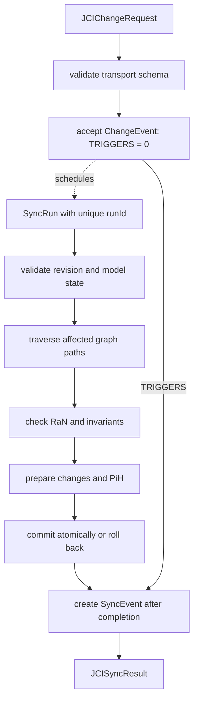

# JCI implementation guide

[Documentation overview](../README.md) · [Deutsch](../../guides/JCI_IMPLEMENTATION_GUIDE.md)

> This document is a controlled English translation. The canonical German specification remains authoritative.

## Purpose

This guide orders the implementation steps. [`JCI_CONTEXT.md`](../JCI_CONTEXT.md), [`JCI_ONTOLOGY.md`](../JCI_ONTOLOGY.md), [`JCI_GRAPH_RULES.md`](../JCI_GRAPH_RULES.md), and [`JCI_SYNC_SPEC.md`](../JCI_SYNC_SPEC.md) remain normative.

## 1. Run the one-time bootstrap

The bootstrap is intended only for a completely empty graph. One atomic transaction creates one `RoFOrg`, one `RoFTeam`, one technical `RoFTeamMember`, one `RoFRole`, exactly one root `RoleAssignment` with `bootstrapKey = "ROOT"`, and one `SYNC` definition. All six entities directly receive `status = ACTIVE`, `revision = 1`, and the same value for `createdAt` and `updatedAt`; any `validFrom` values equal the same bootstrap timestamp. Only the root `RoleAssignment` may exist without `CREATED_BY`; every other bootstrap entity points to it through `CREATED_BY`.

Before commit, validate the empty starting graph, completeness of the minimal graph, and uniqueness of `bootstrapKey = "ROOT"`. On any error, roll everything back. The bootstrap creates no `ChangeEvent`, `SyncRun`, `SyncEvent`, or `PiH`; after a successful commit, repetition and a second root `RoleAssignment` are prohibited. An import is not a bootstrap and later uses the regular SYNC process.

## 2. Store entities

Every node receives the abstract type `JCIEntity` and exactly one concrete `entityType`. Common required properties are UUID, name, timestamps, positive revision, and a type-appropriate status. Newly created entities begin with `revision = 1`. `RoF` and `ERoF` are not stored as dedicated nodes.

A `CiV` stores exactly one value with the required properties `notCiV`, `selfCiV`, and `toServeCiV`. Its scope is exclusively the single `HELD_BY` relationship to `RoFOrg`, `RoFTeam`, or a human `RoFTeamMember`; `purpose`, `values`, and `scope` are not stored on CiV. `INFORMED_BY` documents only explicitly confirmed provenance. All CiV directly grounding one `PiF2` must have the same value holder.

A `Verification` additionally stores `evaluatedResultRevision` and `checkedCriterionRevision`. It is applicable only if it has not been superseded and both bound revisions equal the current revisions of its `Result` and `SuccessCriterion`. For example, if a criterion changes from revision 2 to 3, a verification bound to revision 2 no longer contributes to current target achievement.

## 3. Validate relationships

Only canonical relationship types are permitted. Before activation, validate direction, endpoint types, cardinalities, temporal validity, and additional invariants. Inverse readings do not create duplicate edges.

An active `RaN` has at least one `PROTECTS` to `CiV`, at least one `PROTECTS` to a `PiF2` grounded by that CiV, and at least one `GOVERNS` to a permitted implementation element. Permitted implementation types cover the future levels `PiF1s` through `PiF1o`, work, success and verification, organization, roles, and environment. `PiF2` is not a `GOVERNS` target. Protection relationships are stored only after human confirmation and are not inferred by `SYNC`.

To migrate an existing `GOVERNS` edge to `PiF2`, first prepare a `PROTECTS` candidate to that PiF2. An authorized `RoleAssignment` confirms at least one CiV connected to that PiF2 as protected as well and connects concrete implementation elements through `GOVERNS`. Remove the former edge only after successful SYNC validation. Automatic CiV selection is prohibited.

## 4. Accept a change request

Validate a request against [`schemas/jci-change-request.schema.json`](../../schemas/jci-change-request.schema.json). The schema checks transport structure and data types. After acceptance, store the `ChangeEvent` unambiguously and schedule a technical attempt. Until an attempt ends, the `ChangeEvent` may still have no `TRIGGERS` relationship.

Provenance depends on the change type:

- For a change to an existing entity, that entity points to the `ChangeEvent` through `CHANGED_BY`.
- For `CREATED`, neither a target node nor `CHANGED_BY` exists initially. Only a successful commit creates the node with `revision = 1`, `CREATED_BY`, and `CHANGED_BY`; no `PiH` is created.
- For `HISTORICAL_CORRECTION`, the `ChangeEvent` has no `CHANGED_BY` source and instead has exactly one `TARGETS_HISTORY` relationship to the immutable `PiH`.

Only then does `SYNC` check status, graph structure, `RaN`, revision, and traceability.

## 5. Execute SYNC

A `SyncRun` is technical runtime state, not a graph node. The `SyncEvent` is created only after completion or controlled termination and adopts that attempt's unique `runId`. Every retry gets a new `runId`, its own `SyncEvent`, and another append-only `TRIGGERS` relationship. On `CONFLICT` or `FAILED`, domain changes are rolled back while the final attempt documentation remains or must be recovered later.

For `AFFECTS`, `SUCCESS` and `CONFLICT` document at least one resolved affected `JCIEntity`. Only a `FAILED` attempt that ends before successful target resolution may have no `AFFECTS` relationship.

## 6. Preserve history

Before every committed change to an existing entity, prepare an immutable `PiH` of the complete former state and its valid relationships. New entities start at revision 1 without a `PiH`, because no predecessor state exists. Never overwrite or re-historize an existing `PiH`; correct it only through a new `HistoricalCorrection`.

A correction request transmits `expectedHistoryViewHash` and lexicographically sorted, unique `correctedFields`. Immediately before commit, `SYNC` recalculates the effective `HistoryView`, compares its hash, and serializes commits per `PiH`. A different hash produces `CONFLICT`. Multiple active corrections may affect only disjoint fields. On overlap, the new correction must fully replace exactly one active predecessor through `SUPERSEDES` and repeat every value that remains effective; ambiguous or multiple overlaps also produce `CONFLICT`.

## 7. Exchange and export

- input: `JCIChangeRequest`
- output: `JCISyncResult`
- complete graph: JSON-LD 1.1
- public namespace: `https://eeimicke.github.io/junaco-jci-loop/ns/jci/1.0#`

## 8. Recommended validation order

1. bootstrap conditions or regular request provenance
2. schema and required fields
3. identity, type, expected revision, and status transition
4. relationship types and cardinalities, including conditional `CHANGED_BY` and `AFFECTS` edges
5. CiV dimensions, `HELD_BY`, `INFORMED_BY`, and shared PiF2 scope
6. WHY, WHO, and environmental paths
7. target revisions and applicability of `Verification`
8. Task and future aggregation
9. `PROTECTS` coherence, `GOVERNS` target types, applicable `RaN`, priority, and conflicts
10. prepared revisions and `PiH`, or hash and field conflicts of a historical correction
11. atomic commit or complete rollback
12. immutable `SyncEvent` with unique `runId`
13. counters and response document

## 9. Tests

The Python tests cover central model rules and documentation consistency. A concrete database implementation additionally needs integration, migration, concurrency, rollback, and recovery tests. In particular, test the one-time atomic bootstrap, pending `TRIGGERS = 0`, exactly one `SyncEvent` per `runId`, conditional edges for `CREATED` and early `FAILED`, stale verification revisions, and competing historical corrections against equal and overlapping `HistoryView` states.

