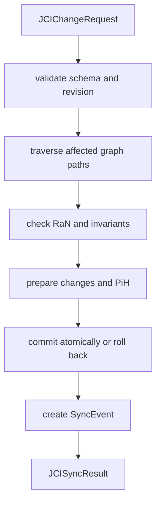

# JCI implementation guide

[Documentation overview](../README.md) · [Deutsch](../../guides/JCI_IMPLEMENTATION_GUIDE.md)

> This document is a controlled English translation. The canonical German specification remains authoritative.

## Purpose

This guide orders the implementation steps. `JCI_CONTEXT.md`, `JCI_ONTOLOGY.md`, `JCI_GRAPH_RULES.md`, and `JCI_SYNC_SPEC.md` remain normative.

## 1. Store entities

Every node receives the abstract type `JCIEntity` and exactly one concrete `entityType`. Common required properties are UUID, name, timestamps, positive revision, and a type-appropriate status. `RoF` and `ERoF` are not stored as dedicated nodes.

## 2. Validate relationships

Only canonical relationship types are permitted. Before activation, validate direction, endpoint types, cardinalities, temporal validity, and additional invariants. Inverse readings do not create duplicate edges.

## 3. Accept a change request

Validate a request against `schemas/jci-change-request.schema.json`. The schema checks transport structure and data types. `SYNC` then checks status, graph structure, `RaN`, revision, and traceability.

## 4. Execute SYNC

A `SyncRun` is technical runtime state, not a graph node. The `SyncEvent` is created only after completion or controlled termination. On `CONFLICT` or `FAILED`, domain changes are rolled back while the final attempt documentation remains or must be recovered later.

## 5. Preserve history

Before every change that is actually committed, prepare an immutable `PiH` of the complete former state and its valid relationships. New entities start at revision 1 without a `PiH`. Correct an existing `PiH` only through a new `HistoricalCorrection`.

## 6. Exchange and export

- input: `JCIChangeRequest`
- output: `JCISyncResult`
- complete graph: JSON-LD 1.1
- public namespace: `https://eeimicke.github.io/junaco-jci-loop/ns/jci/1.0#`

## 7. Recommended validation order

1. schema and required fields
2. identity, type, expected revision, and status transition
3. relationship types and cardinalities
4. WHY, WHO, and environmental paths
5. Task and future aggregation
6. applicable `RaN`, priority, and conflicts
7. prepared revisions and `PiH`
8. atomic commit
9. immutable `SyncEvent`
10. counters and response document

## 8. Tests

The Python tests cover central model rules and documentation consistency. A concrete database implementation additionally needs integration, migration, concurrency, rollback, and recovery tests.

