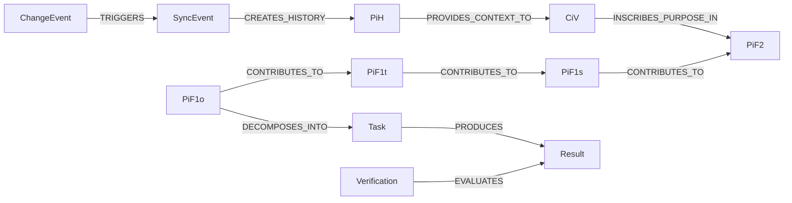

# Introduction to the JCI Loop

[Documentation overview](../README.md) · [Deutsch](../../guides/JCI_INTRODUCTION.md)

> This document is a controlled English translation. If it differs from the canonical German specification, the German version prevails until the discrepancy has been resolved.

## The central proposition

Organisations rarely fail because no goals, roles, or rules exist at all. They often fail because these elements no longer fit together: a goal changes while tasks, responsibilities, systems, or rules remain unchanged.

The **JCI Loop** represents these connections in one graph and makes change traceable. It answers not only *what* is done, but also *why*, *by whom*, *under which rules*, *in which environment*, and *with which historical context*.

`CiV` describes purpose and values. `PiF2` through `PiF1o` translate that purpose into increasingly concrete future states. Tasks realise the operational state and results are verified. `RaN` constrains decisions, `RoF` assigns responsibility, and `ERoF` describes the relevant environment. `SYNC` traces changes; superseded states remain available as `PiH`.

## What distinguishes JCI

- **A graph rather than isolated lists:** relationships are part of the model.
- **WHY path:** a task can be traced back to its value-based purpose.
- **WHO path:** execution, team, member, role, and organisation remain explicit.
- **Verifiable targets:** a `PiF1o` has success criteria; Results and Verifications remain separate.
- **Rules across domains:** `RaN` can permit, require, or prohibit a concrete decision.
- **History:** only states that are actually superseded are preserved as immutable `PiH`.
- **Controlled change:** `SYNC` checks impact, conflicts, revisions, and derived changes.

## What JCI is not

JCI is neither finished software nor an organisational chart. It is a technology-independent domain model. An application may implement it in Neo4j, for example, but must preserve the specified entities, relationships, status rules, and invariants.

Continue with the [JCI elements](JCI_ELEMENTS.md) or the [end-to-end example](JCI_EXAMPLE.md).

