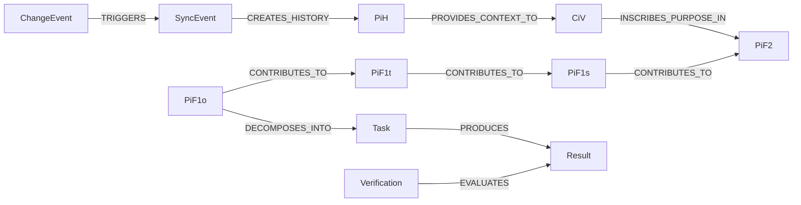

# Introducing the JCI Loop

[Documentation overview](../README.md) · [Deutsch](../../guides/JCI_INTRODUCTION.md)

## The initial thesis

Organizations rarely fail because there are no goals, roles or rules at all. They often fail because these elements no longer fit together: a goal changes while tasks, responsibilities, systems or rules remain unchanged.

The **JCI Loop** describes these relationships in a common graph and makes changes traceable. It answers not only *what* is done, but also *why*, *by whom*, *under what rules*, *in what environment* and *with what historical context*.

## The context

`CiV` describes purpose and values. `PiF2` to `PiF1o` translate this purpose into increasingly concrete future states. Tasks realize the operational state. Results are checked. `RaN` limits decisions, `RoF` assigns responsibility and `ERoF` describes the relevant environment. `SYNC` tracks changes; superseded states remain as `PiH`.

## What makes JCI special

- **Graph instead of isolated lists:** Relationships belong to the model and are not just free text.
- **WHY path:** You can go back from a Task to the value-related purpose.
- **WHO path:** Execution, team, member, role and organization remain clear.
- **Testable Goals:** A `PiF1o` has success criteria; Results and verifications remain separate.
- **Rules as a cross-section:** `RaN` can allow, require or prohibit specific decisions.
- **Historization:** Only actually superseded states are preserved as immutable `PiH`.
- **Controlled Change:** `SYNC` checks effects, conflicts, revisions and consequential changes.

## What JCI is not

JCI is not a finished software or an organizational chart. It is a technology-independent professional model. For example, an application can implement it in Neo4j, but must comply with the documented entities, relationships, state rules and invariants.

## Next step

Next, read the [JCI Element Overview](JCI_ELEMENTS.md) or follow the [Walkthrough Example](JCI_EXAMPLE.md).

