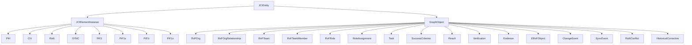
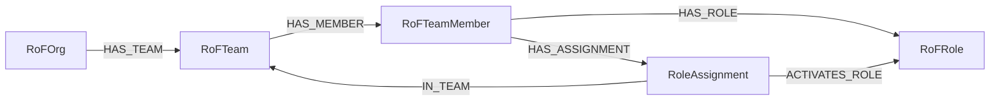
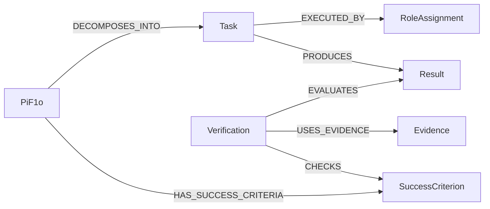
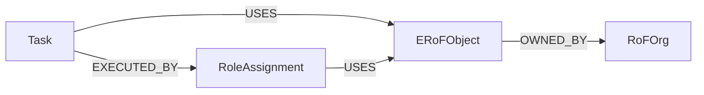

# Die Elemente des JCI Loop

[Dokumentationsübersicht](../README.md) · [English](../en/guides/JCI_ELEMENTS.md)

## Zehn Kernelemente

| Element | Einfache Bedeutung                                          |
| ------- | ----------------------------------------------------------- |
| `PiH`   | bewahrt einen früheren, abgelösten Zustand                  |
| `CiV`   | beschreibt einen Wert durch NOT, SELF und TO SERVE          |
| `RaN`   | schützt CiV und PiF2 und regelt deren konkrete Umsetzung    |
| `RoF`   | Modellraum für Organisationen, Teams, Mitglieder und Rollen |
| `ERoF`  | Modellraum für die relevante Umwelt handelnder Rollen       |
| `SYNC`  | gespeicherte Definition der Synchronisationslogik           |
| `PiF2`  | langfristiger Zukunftszustand über zehn Jahre               |
| `PiF1s` | strategischer Zukunftszustand über fünf bis zehn Jahre      |
| `PiF1t` | taktischer Zukunftszustand über ein bis fünf Jahre          |
| `PiF1o` | operativer Zukunftszustand unter einem Jahr                 |

`RoF` und `ERoF` sind Kernelemente, aber keine eigenen Knoten. Sie werden aus ihren konkreten Graphobjekten und Beziehungen sichtbar.

## Gespeicherte Entitäten



`JCIEntity` ist der gemeinsame abstrakte Oberbegriff. Jede gespeicherte Entität besitzt mindestens `id`, `entityType`, `name`, `createdAt`, `updatedAt`, `revision` und `status`.

## Organisation und Rollen



Ein `RoleAssignment` bedeutet: Ein bestimmtes Mitglied aktiviert eine vorhandene Rolle in einem bestimmten Team. Dadurch kann dieselbe Person dieselbe Rolle in mehreren Teams ausüben, ohne die Rolle oder Person zu duplizieren.

### Einmalige Initialisierung

In einem vollständig leeren Graphen gibt es zunächst noch keine Rollenaktivierung, die als Erzeuger dienen kann. Deshalb darf ein einmaliger atomarer Bootstrap eine `RoFOrg`, ein `RoFTeam`, ein technisches `RoFTeamMember`, eine `RoFRole`, genau ein `RoleAssignment` mit `bootstrapKey = "ROOT"` und eine `SYNC`-Definition gemeinsam anlegen. Alle sechs Entitäten entstehen direkt mit `status = ACTIVE`, `revision = 1` sowie demselben `createdAt` und `updatedAt`; vorhandene `validFrom`-Werte entsprechen demselben Bootstrapzeitpunkt. Nur dieses Root-`RoleAssignment` darf dauerhaft ohne `CREATED_BY` bestehen; alle weiteren Bootstrap-Entitäten verweisen mit `CREATED_BY` auf dieses Root-`RoleAssignment`.

Der Bootstrap ist nur bei einem vollständig leeren Graphen zulässig. Er erzeugt weder `ChangeEvent`, `SyncRun`, `SyncEvent` noch `PiH`, und alle erzeugten Entitäten beginnen mit `revision = 1`. Nach erfolgreichem Abschluss sind ein zweiter Bootstrap und ein zweites Root-`RoleAssignment` ausgeschlossen. Ein Datenimport ist kein Bootstrap.

## Arbeit, Ergebnis und Prüfung



- `Task`: Was wird getan?
- `Result`: Was wurde erzeugt?
- `Evidence`: Womit lässt es sich belegen?
- `Verification`: Wie wurde das Ergebnis gegen ein Kriterium bewertet?

Eine `Verification` hält nicht nur die Beziehungen zu genau einem `Result` und genau einem `SuccessCriterion` fest, sondern auch deren tatsächlich geprüfte Revisionen. Beispiel: Eine Prüfung mit `evaluatedResultRevision = 3` und `checkedCriterionRevision = 2` ist nur anwendbar, solange genau diese Revisionen aktuell sind und die Prüfung nicht durch `SUPERSEDES` ersetzt wurde. Wird eines der beiden Ziele später geändert, bleibt die Prüfung als Nachweis erhalten, gilt für den aktuellen Zustand aber als revisionsveraltet.

### Aktueller Arbeitsumfang und Revisionsbezug

Alle Tasks behalten ihren direkten PiF1o-Kontext. Für die aktuelle Zielerreichung werden Tasks und Kriterien in `REPLACED` oder `REVOKED` ausgeschlossen; `COMPLETED` bleibt ein aktueller Task-Beitrag. Ein Ziel benötigt weiterhin mindestens einen aktuellen Task und mindestens ein aktuelles `REQUIRED`-Kriterium. Alle aktuellen Tasks müssen abgeschlossen und alle aktuellen Pflichtkriterien aktiv und erfüllt sein. Leere Mengen, ungeklärte Nachkommen oder Regelverletzungen erlauben keinen Abschluss. Alte Results und Verifications werden nicht stillschweigend für neue Arbeit übernommen.

Ein Composite kann eigene `DEPENDS_ON`-Voraussetzungen besitzen: Solange eine unerfüllt ist, bleibt der freigegebene Composite `BLOCKED`, auch wenn seine Kinder abgeschlossen sind. Bei erfüllten Voraussetzungen bestimmt der aktuelle Kinderumfang den Status. Ein freigegebener Composite fällt bei nur noch `DRAFT`-Kindern auf `ACTIVE`, nicht zurück in den Entwurf. `DRAFT` benötigt zunächst die reguläre Freigabe und darf nicht durch Umfangsreduktion `COMPLETED` werden. Der gemeinsame Abschlussgraph aus `DECOMPOSES_INTO` und `DEPENDS_ON` muss zyklusfrei sein.

Neue `EVALUATES`, `CHECKS`, `USES_EVIDENCE` und `SUPERSEDES` einer Verification gehören zur neuen Prüfung. Sie erhöhen die Revisionen der referenzierten Ziele nicht. Eine echte Kriterienänderung macht die ältere Prüfung dagegen weiterhin revisionsveraltet. Die [Änderungsdokumentation](../changes/JCI_LOGIC_2_0.md) erläutert diese Regeln.

### Menschliche Freigabe

Eine Task-Freigabe wird zuerst an das `ACCOUNTABLE_MEMBER` des zugehörigen `PiF1o` gerichtet. Nur eine ausdrücklich durch `RaN` befugte menschliche Rollenaktivierung darf genehmigen. Fehlt die Befugnis, wird entlang aller erforderlichen Zukunftszweige zu `PiF1t`, `PiF1s` und höchstens `PiF2` eskaliert. Auch diese Ebenen können Accountability besitzen; eine fehlende Zuordnung wird nicht erfunden. Ablehnung und Regelkonflikt erlauben keine Eskalation als Umgehung.

Der Antragsteller bleibt über `REQUESTED_BY`, die Genehmigung über `APPROVED_BY` nachvollziehbar. Erst nach erfolgreicher `SYNC`-Prüfung wird der Task `ACTIVE` oder bei offenen Voraussetzungen `BLOCKED`. Freigabe bedeutet weder Ausführung noch Abschluss. Wertentscheidungen zu `CiV` und `PROTECTS` benötigen ebenfalls einen konkreten menschlichen Nachweis. Details stehen im [Freigabeprofil](../JCI_CONTEXT.md#129-nachweisbare-menschliche-freigabe--profil-10).

## Umwelt



Ein aktives Umweltobjekt muss von mindestens einer Rollenaktivierung verwendet werden. Eigentum allein belegt keine Interaktion. Ob ein Objekt intern oder extern ist, wird relativ zur betrachteten Organisation aus `OWNED_BY` abgeleitet.

### Beispiel

Der Task `Kundenportal bereitstellen` verwendet das `ERoFObject` `GitHub-Repository`. Anna führt den Task in ihrer aktivierten Rolle `Developer` aus und verwendet dabei ebenfalls dieses Repository. Das Repository gehört der betrachteten `RoFOrg` und ist deshalb aus ihrer Sicht ein internes Umweltobjekt.

```text
Task: Kundenportal bereitstellen
  ├── EXECUTED_BY ──► RoleAssignment: Anna als Developer
  └── USES ─────────► ERoFObject: GitHub-Repository
                           ▲
RoleAssignment ── USES ────┘
ERoFObject ── OWNED_BY ──► RoFOrg: Beispiel GmbH
```

Gehörte das Repository stattdessen einer Partnerorganisation, wäre es aus Sicht der Beispiel GmbH ein externes Umweltobjekt. Entscheidend ist immer die Beziehung `OWNED_BY` zur betrachteten Organisation.

## Veränderungsobjekte

- `ChangeEvent`: Anlass und Auftrag einer Änderung.
- `SyncEvent`: unveränderliches Ergebnis eines beendeten technischen Laufs.
- `PiH`: vorheriger Zustand einer tatsächlich geänderten Entität.
- `RaNConflict`: nicht automatisch entscheidbarer Regelkonflikt.
- `HistoricalCorrection`: Berichtigung eines `PiH`, ohne dieses zu überschreiben.

Ein angenommenes `ChangeEvent` darf zunächst noch keine `TRIGGERS`-Beziehung besitzen: `TRIGGERS = 0` bezeichnet den ausstehenden Zustand, bevor ein technischer Versuch beendet wurde. Jeder abgeschlossene oder kontrolliert abgebrochene `SyncRun` erzeugt genau ein unveränderliches `SyncEvent` mit eigener eindeutiger `runId` und ergänzt genau eine `TRIGGERS`-Beziehung. Ein erneuter Versuch erhält eine neue `runId` und ein eigenes `SyncEvent`.

`CHANGED_BY` und `AFFECTS` gelten deshalb bedingt:

- Bei der Änderung einer vorhandenen Entität verweist diese über `CHANGED_BY` auf das `ChangeEvent`.
- Bei `CREATED` gibt es vor dem erfolgreichen Commit noch keine Quellentität. Nur bei `SUCCESS` entstehen die neue Entität mit `revision = 1`, `CREATED_BY` und `CHANGED_BY`; für diese neue Entität entsteht kein `PiH`. Vorhandene veränderliche Eigentümer mit geänderten Strukturbeziehungen erhalten eine eigene Historie. Bei `CONFLICT` oder `FAILED` entstehen weder Zielknoten noch diese Beziehungen.
- Ein `SyncEvent` mit `SUCCESS` oder `CONFLICT` besitzt mindestens ein `AFFECTS`-Ziel. Nur ein früher `FAILED`-Versuch, der das Ziel noch nicht auflösen konnte, darf kein `AFFECTS` besitzen.

Eine historische Korrektur verändert weder das `PiH` noch erzeugt sie ein neues `PiH`. Das zugehörige `ChangeEvent` verweist stattdessen mit `TARGETS_HISTORY` auf genau das betroffene `PiH`. Vor dem Commit vergleicht `SYNC` den erwarteten Hash der wirksamen `HistoryView` mit dem aktuellen Hash. Aktive Korrekturen dürfen nur auf dekodierter Segmentebene überschneidungsfreie `correctedFields` betreffen; eine überlappende Korrektur muss genau eine aktive Vorgängerkorrektur vollständig über `SUPERSEDES` ersetzen. Andernfalls endet der Versuch mit `CONFLICT`.

Korrekturpfade des Profils 2.0 benennen vollständige Properties, beispielsweise `/stateData/properties/name`, oder stabile Beziehungseinträge und deren vollständige Properties. Eltern- und Unterpfade überschneiden sich; Listenindizes sind unzulässig. Vorhandene PiH und Hashes werden nicht umgeschrieben. Die gemeinsame technische Schreibsperre schützt Prüfungsmenge, Regeln, Beziehungen und Zeitgültigkeit bis zur atomaren Übernahme.

Für sämtliche Pflichtfelder und Kardinalitäten ist die [kanonische Spezifikation](../JCI_CONTEXT.md) maßgeblich.

