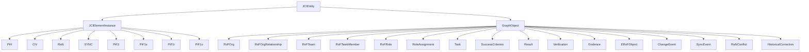
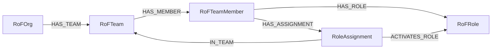
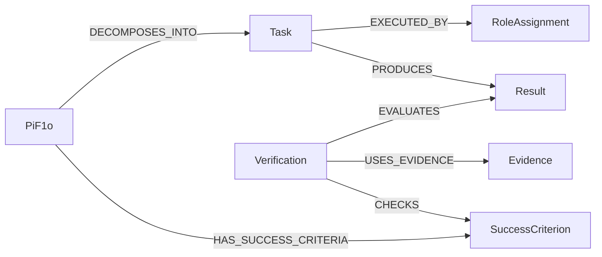
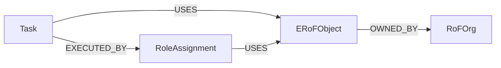

# Die Elemente des JCI Loop

[Dokumentationsübersicht](../README.md) · [English](../en/guides/JCI_ELEMENTS.md)

## Zehn Kernelemente

| Element | Einfache Bedeutung |
|---|---|
| `PiH` | bewahrt einen früheren, abgelösten Zustand |
| `CiV` | beschreibt Zweck und Werte |
| `RaN` | beschreibt Regeln und Normen |
| `RoF` | Modellraum für Organisationen, Teams, Mitglieder und Rollen |
| `ERoF` | Modellraum für die relevante Umwelt handelnder Rollen |
| `SYNC` | gespeicherte Definition der Synchronisationslogik |
| `PiF2` | langfristiger Zukunftszustand über zehn Jahre |
| `PiF1s` | strategischer Zukunftszustand über fünf bis zehn Jahre |
| `PiF1t` | taktischer Zukunftszustand über ein bis fünf Jahre |
| `PiF1o` | operativer Zukunftszustand unter einem Jahr |

`RoF` und `ERoF` sind Kernelemente, aber keine eigenen Knoten. Sie werden aus ihren konkreten Graphobjekten und Beziehungen sichtbar.

## Gespeicherte Entitäten



`JCIEntity` ist der gemeinsame abstrakte Oberbegriff. Jede gespeicherte Entität besitzt mindestens `id`, `entityType`, `name`, `createdAt`, `updatedAt`, `revision` und `status`.

## Organisation und Rollen



Ein `RoleAssignment` bedeutet: Ein bestimmtes Mitglied aktiviert eine vorhandene Rolle in einem bestimmten Team. Dadurch kann dieselbe Person dieselbe Rolle in mehreren Teams ausüben, ohne die Rolle oder Person zu duplizieren.

## Arbeit, Ergebnis und Prüfung



- `Task`: Was wird getan?
- `Result`: Was wurde erzeugt?
- `Evidence`: Womit lässt es sich belegen?
- `Verification`: Wie wurde das Ergebnis gegen ein Kriterium bewertet?

## Umwelt



Ein aktives Umweltobjekt muss von mindestens einer Rollenaktivierung verwendet werden. Eigentum allein belegt keine Interaktion. Ob ein Objekt intern oder extern ist, wird relativ zur betrachteten Organisation aus `OWNED_BY` abgeleitet.

### Beispiel

Der Task `Kundenportal bereitstellen` verwendet das `ERoFObject` `GitHub-Repository`. Anna führt den Task in ihrer aktivierten Rolle `Developer` aus und verwendet dabei ebenfalls dieses Repository. Das Repository gehört der betrachteten `RoFOrg` und ist deshalb aus ihrer Sicht ein internes Umweltobjekt.

```text
Task: Kundenportal bereitstellen
  ├── EXECUTED_BY ──► RoleAssignment: Anna als Developer
  └── USES ─────────► ERoFObject: GitHub-Repository
                           ▲
RoleAssignment ── USES ────┘
ERoFObject ── OWNED_BY ──► RoFOrg: Beispiel GmbH
```

Gehörte das Repository stattdessen einer Partnerorganisation, wäre es aus Sicht der Beispiel GmbH ein externes Umweltobjekt. Entscheidend ist immer die Beziehung `OWNED_BY` zur betrachteten Organisation.

## Veränderungsobjekte

- `ChangeEvent`: Anlass und Auftrag einer Änderung.
- `SyncEvent`: unveränderliches Ergebnis eines beendeten technischen Laufs.
- `PiH`: vorheriger Zustand einer tatsächlich geänderten Entität.
- `RaNConflict`: nicht automatisch entscheidbarer Regelkonflikt.
- `HistoricalCorrection`: Berichtigung eines `PiH`, ohne dieses zu überschreiben.

Für sämtliche Pflichtfelder und Kardinalitäten ist die [kanonische Spezifikation](../JCI_CONTEXT.md) maßgeblich.

