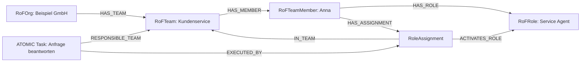
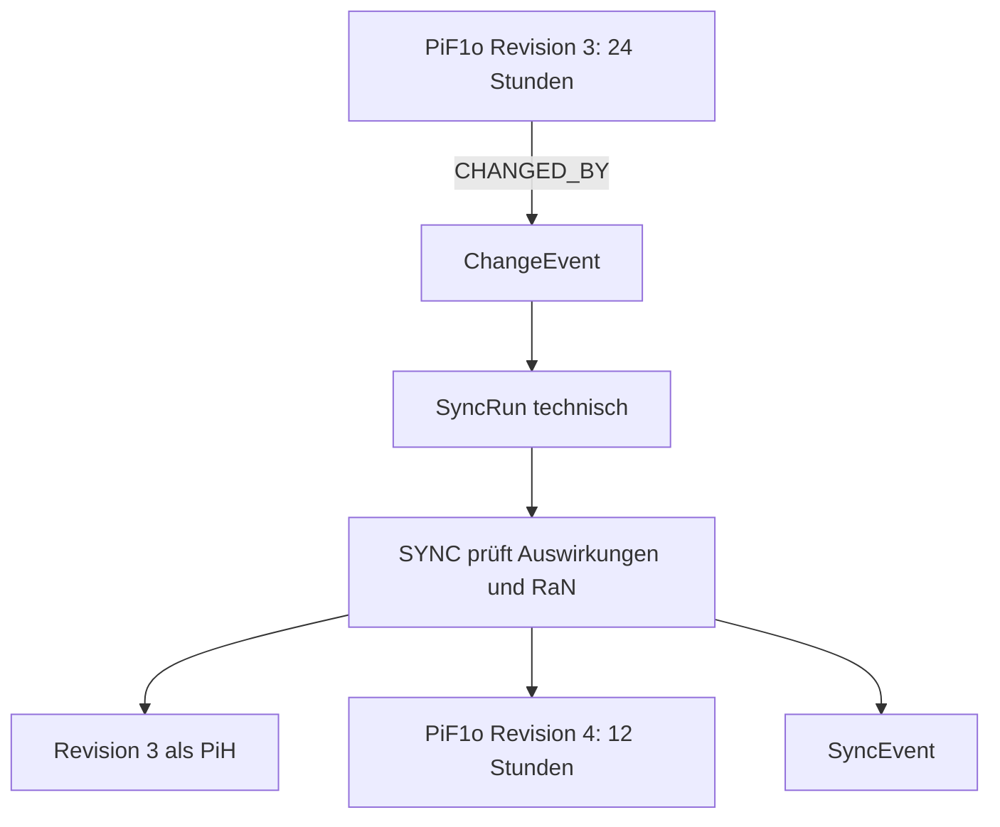

# Durchgängiges JCI-Beispiel

[Dokumentationsübersicht](../README.md) · [English](../en/guides/JCI_EXAMPLE.md)

## Ausgangssituation

Eine Organisation möchte Kundenanfragen zuverlässig innerhalb von 24 Stunden beantworten.

## 1. Zweck und Zukunft

```text
CiV   = Wir handeln kundenorientiert und verbindlich.
PiF2  = Kunden erleben die Organisation langfristig als verlässlichen Partner.
PiF1s = Der Kundenservice arbeitet durchgängig digital und lernfähig.
PiF1t = Alle Anfragekanäle sind in einem gemeinsamen Serviceprozess verbunden.
PiF1o = Jede Kundenanfrage erhält innerhalb von 24 Stunden eine qualifizierte Antwort.
```

Die Zukunftselemente werden über `CONTRIBUTES_TO` vom konkreteren zum übergeordneten Zustand verbunden. `CiV` schreibt den Zweck über `INSCRIBES_PURPOSE_IN` in `PiF2` ein.

## 2. Erfolg und Verantwortung

Der `PiF1o` erhält:

```text
SuccessCriterion
├── measurementType = NUMERIC
├── operator = LESS_OR_EQUAL
├── targetValue = 24
└── unit = hours

PiF1o ── ACCOUNTABLE_MEMBER ──► RoFTeamMember: Anna
```

Anna ist für den operativen Zustand accountable. Sie muss nicht jeden Task selbst ausführen.

## 3. Team, Rolle und Arbeit



Ein zusammengesetzter Task kann Analyse, Antwort und Qualitätsprüfung strukturieren. Nur atomare Tasks werden direkt ausgeführt.

## 4. Umwelt

Das ausführende `RoleAssignment` verwendet ein Ticketsystem und eine Wissensdatenbank:

```text
RoleAssignment ── USES ──► ERoFObject: Ticketsystem
RoleAssignment ── USES ──► ERoFObject: Wissensdatenbank
Task           ── USES ──► dieselben ERoFObjects
```

Damit bleibt jede Umweltinteraktion an eine handelnde Rolle in einem Team gebunden.

## 5. Ergebnis und Prüfung

Der Task produziert ein `Result` mit Antwortzeit und Antwortreferenz. Eine `Verification` bewertet dieses Result gegen das Erfolgskriterium und verwendet bei Bedarf ein `Evidence` aus dem Ticketsystem.

```text
Task ── PRODUCES ──► Result
Verification ── EVALUATES ──► Result
Verification ── CHECKS ──► SuccessCriterion
Verification ── USES_EVIDENCE ──► Evidence
```

Erst wenn alle verpflichtenden Kriterien gültig geprüft, alle Tasks abgeschlossen und alle Abhängigkeiten erfüllt sind, darf `SYNC` den `PiF1o` auf `ACHIEVED` setzen.

## 6. Regel

Eine `RaN` verlangt, dass personenbezogene Kundendaten nur durch berechtigte Rollen verwendet werden. `SYNC` prüft die Regel vor einer Änderung. Eine einzelne Verletzung führt zu `DENY`; erst widersprüchliche anwendbare Regeln derselben Entscheidung können einen `RaNConflict` bilden.

## 7. Änderung und Historie

Das Ziel wird später von 24 auf 12 Stunden verschärft:



Betroffene Entitäten werden geprüft. Nur tatsächlich geänderte Entitäten erhalten eine neue Revision und ein eigenes `PiH`. Das abschließende `SyncEvent` dokumentiert den Versuch.

## Rückverfolgbarkeit

Vom Task lässt sich nun beantworten:

- **WHY:** Welchem `PiF1o`, welcher Zukunft und welchem `CiV` dient er?
- **WHO:** Welches RoleAssignment, Mitglied, Team und welche Organisation führen ihn aus?
- **WHERE:** Welche `ERoFObjects` werden verwendet?
- **UNDER WHICH RULES:** Welche `RaN` gelten?
- **WITH WHAT HISTORY:** Welche früheren Zustände liegen als `PiH` vor?

