# Durchgängiges JCI-Beispiel

[Dokumentationsübersicht](../README.md) · [English](../en/guides/JCI_EXAMPLE.md)

Dieses Beispiel führt anhand eines einzigen Falls durch alle 24 konkreten JCI-Entitätstypen. Es zeigt gespeicherte Beziehungen, ihre Vorwärts- und Rückwärtslesart sowie die Ergebnisse `SUCCESS`, `CONFLICT` und `FAILED` eines Synchronisationsversuchs.

## 1. Beziehungen lesen

Eine gespeicherte Beziehung wird immer von der Quelle zum Ziel gelesen:

```text
Quelle ── BEZIEHUNG ──► Ziel
```

`Task ── PRODUCES ──► Result` bedeutet vorwärts: „Welches Result erzeugt dieser Task?“ Rückwärts kann gefragt werden: „Durch welchen Task entstand dieses Result?“ Diese Rückwärtsfrage ist nur Navigation; sie erzeugt keine zusätzliche Kante.

| Gespeicherte Richtung                         | Vorwärtsfrage                           | Rückwärtsfrage                                     |
| --------------------------------------------- | --------------------------------------- | -------------------------------------------------- |
| `PiF1o ── DECOMPOSES_INTO ──► Task`           | Welche Tasks realisieren das Ziel?      | Zu welchem operativen Ziel gehört der Task?        |
| `Task ── EXECUTED_BY ──► RoleAssignment`      | Welche aktive Rolle führt den Task aus? | Welche Tasks führt diese Rollenaktivierung aus?    |
| `Verification ── CHECKS ──► SuccessCriterion` | Welches Kriterium wird geprüft?         | Welche Prüfungen bewerten dieses Kriterium?        |
| `SyncEvent ── CREATES_HISTORY ──► PiH`        | Welche Historie erzeugte der Lauf?      | Durch welchen Lauf entstand dieses `PiH`?          |
| `ChangeEvent ── TARGETS_HISTORY ──► PiH`      | Welches `PiH` soll berichtigt werden?   | Welche Korrekturaufträge adressieren dieses `PiH`? |

## 2. Ausgangssituation und Zweck

Die Beispiel GmbH möchte Kundenanfragen zuverlässig beantworten. Frühere Beschwerden über verspätete Antworten sind als historischer Kontext festgehalten:

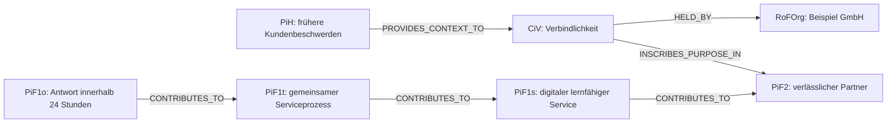

| Entität | Beispielinhalt                                                                                                                                                                                         |
| ------- | ------------------------------------------------------------------------------------------------------------------------------------------------------------------------------------------------------ |
| `PiH`   | Frühere Beschwerden wegen verspäteter Antworten                                                                                                                                                        |
| `CiV`   | Verbindlichkeit: NOT = Zusagen bleiben nicht folgenlos; SELF = Wir halten Zusagen nachvollziehbar ein; TO SERVE = Kunden erhalten verlässliche Orientierung. `HELD_BY` verweist auf die Beispiel GmbH. |
| `PiF2`  | Kunden erleben die Organisation langfristig als verlässlichen Partner.                                                                                                                                 |
| `PiF1s` | Der Kundenservice arbeitet vollständig digital und lernfähig.                                                                                                                                          |
| `PiF1t` | Alle Anfragekanäle sind in einem Serviceprozess verbunden.                                                                                                                                             |
| `PiF1o` | Jede Anfrage erhält innerhalb von 24 Stunden eine qualifizierte Antwort.                                                                                                                               |

Vom `PiF1o` lässt sich rückwärts bis zu `CiV` und dem historischen Kontext navigieren. So ist erkennbar, warum das operative Ziel existiert.

### 2.1 Vorbedingung: einmaliger Bootstrap

Bevor dieses fachliche Beispiel in einem vollständig leeren Graphen angelegt werden kann, wird einmalig die technische Vertrauenswurzel erzeugt:

```text
RoFOrg: Beispiel GmbH
└── RoFTeam: Technische Administration
    └── RoFTeamMember: JCI-System
        ├── RoFRole: JCI-Administration
        └── RoleAssignment: JCI-System als Administration
            └── bootstrapKey = "ROOT"

SYNC: JCI-Standardprozess
```

Diese Entitäten werden in einer einzigen Transaktion mit `status = ACTIVE`, `revision = 1` sowie demselben `createdAt` und `updatedAt` angelegt; vorhandene `validFrom`-Werte entsprechen demselben Bootstrapzeitpunkt. Nur das Root-`RoleAssignment` besitzt kein `CREATED_BY`; alle weiteren Bootstrap-Entitäten verweisen auf dieses Root-`RoleAssignment`. Der Bootstrap erzeugt kein `ChangeEvent`, keinen `SyncRun`, kein `SyncEvent` und kein `PiH`. Erst danach legt das Root-`RoleAssignment` die fachlichen Entitäten dieses Beispiels über reguläre `CREATED`-Aufträge an. Ein zweiter Bootstrap ist nicht zulässig.

## 3. Organisation, Partnerschaft und Rollen

Die Beispiel GmbH nutzt eine Plattform der Service Cloud AG. Beide bleiben eigenständige Organisationen:

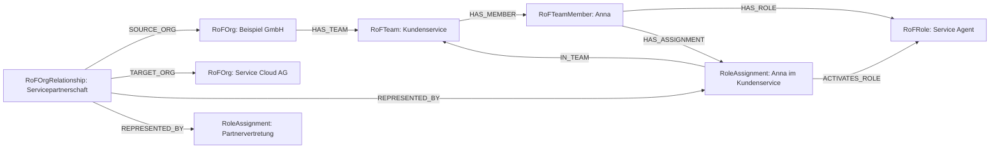

Ein zweites `RoleAssignment` der Service Cloud AG vertritt die Partnerseite der Beziehung. `RoFOrgRelationship` verbindet Organisationen, führt ihre Teams und Rollen aber nicht zusammen.

Verantwortung und Ausführung bleiben getrennt:

```text
PiF1o ── ACCOUNTABLE_MEMBER ──► RoFTeamMember: Anna
Task   ── RESPONSIBLE_TEAM ───► RoFTeam: Kundenservice
Task   ── EXECUTED_BY ────────► RoleAssignment: Anna als Service Agent
```

## 4. Task-Hierarchie und Arbeit

Der `PiF1o` wird durch einen zusammengesetzten Task strukturiert. Alle Tasks gehören direkt zu diesem `PiF1o`; die Task-zu-Task-Beziehungen bilden zusätzlich die Hierarchie.

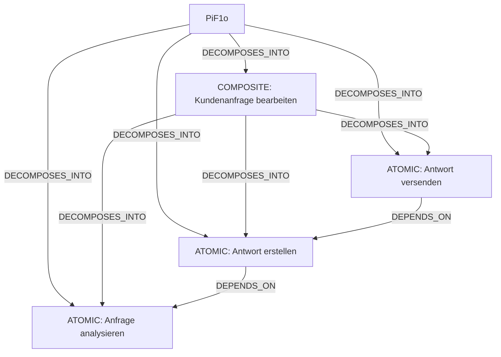

Nur die atomaren Tasks besitzen `EXECUTED_BY`, `USES` und `PRODUCES`. Der Status des zusammengesetzten Tasks wird aus seinen direkten Untertasks abgeleitet.

## 5. Umwelt

Anna und der Task verwenden interne sowie externe Umweltobjekte:

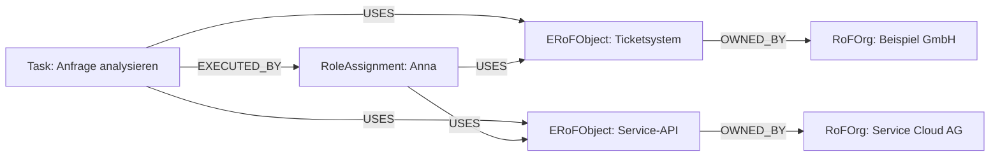

Das Ticketsystem ist relativ zur Beispiel GmbH intern. Die Service-API ist extern, weil sie der Partnerorganisation gehört. `OWNED_BY` bestimmt diese Perspektive; tatsächliche Interaktion wird ausschließlich durch `USES` belegt.

## 6. Erfolg, Result und Verification

Der operative Zustand besitzt ein verpflichtendes numerisches Kriterium:

```text
SuccessCriterion
├── measurementType = NUMERIC
├── operator = LESS_OR_EQUAL
├── targetValue = 24
├── unit = hours
└── requirementLevel = REQUIRED
```

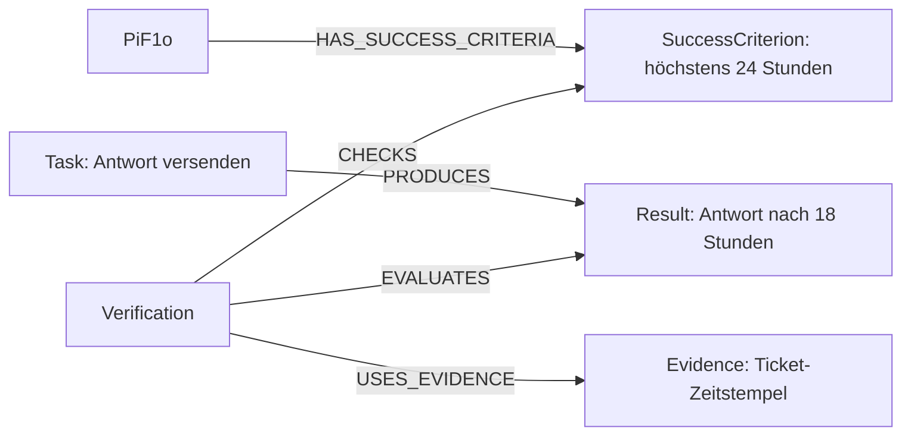

Da 18 kleiner oder gleich 24 ist, wird die vollständig erzeugte `Verification` mit dem fachlichen Ergebnis `VALID` abgeschlossen. Angenommen, das geprüfte `Result` besitzt `revision = 3` und das geprüfte `SuccessCriterion` `revision = 2`; dann speichert die Prüfung zusätzlich:

```text
Verification
├── evaluatedResultRevision = 3
└── checkedCriterionRevision = 2
```

Die `Verification` ist nur anwendbar, solange sie nicht ersetzt wurde und die aktuellen Revisionen beider Ziele weiterhin diesen gebundenen Revisionen entsprechen. Wird das Kriterium später auf zwölf Stunden geändert und dadurch zu Revision 3, bleibt die frühere Prüfung unveränderlich erhalten, ist für den neuen Zielzustand aber revisionsveraltet. Eine neue Prüfung bindet die aktuellen Zielrevisionen und kann über `SUPERSEDES` auf die frühere `Verification` verweisen.

## 7. RaN-Typen und Aufbau

`RaN` ist ein Entitätstyp. `RULE`, `NORM`, `POLICY`, `CONSTRAINT` und `LAW` sind Werte seiner Eigenschaft `ruleType`, keine zusätzlichen Knoten.

| `ruleType`   | Beispiel                                                     |
| ------------ | ------------------------------------------------------------ |
| `RULE`       | Jede Anfrage benötigt eine Kategorie.                        |
| `NORM`       | Antworten verwenden die freigegebene Vorlage.                |
| `POLICY`     | Kundendaten dürfen nur berechtigte Rollen verwenden.         |
| `CONSTRAINT` | Antworten müssen innerhalb von 24 Stunden erfolgen.          |
| `LAW`        | Personenbezogene Daten müssen rechtmäßig verarbeitet werden. |

Jedes `RaN` besitzt außerdem `effect = REQUIRE | PROHIBIT | PERMIT`, `scopeType = GLOBAL | ORGANIZATION | TEAM | ENTITY`, `decisionKey`, `governedTypes`, `priority` und eine normalisierte `condition` mit `combiner = ALL | ANY`.

Ein aktives `RaN` schützt mindestens ein `CiV` und mindestens ein daraus begründetes `PiF2` über `PROTECTS`. `GOVERNS` verbindet dagegen die konkrete Umsetzung, auf der die Bedingung ausgewertet wird. In diesem Beispiel schützt die Zugriffsregel das CiV „Verbindlichkeit“ und das langfristige Zukunftsbild „verlässlicher Partner“.

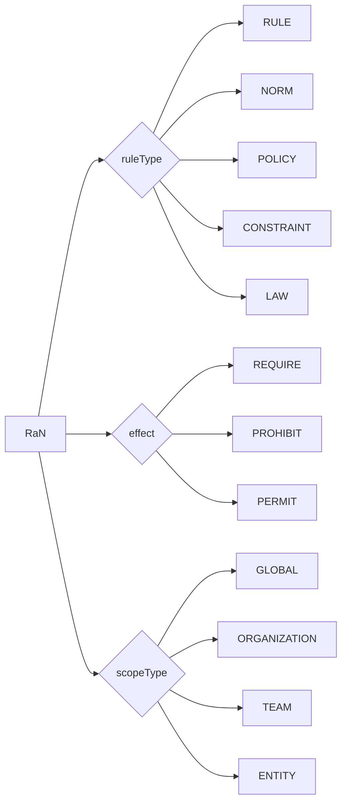

Die Pfeile dieser Typgrafik veranschaulichen Eigenschaften und sind keine gespeicherten JCI-Beziehungen.

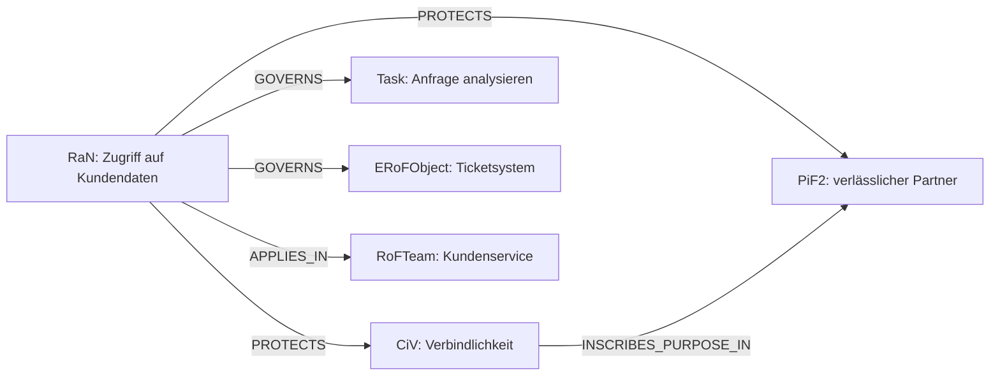

Die Condition-Klauseln verwenden ausschließlich `EXISTS`, `NOT_EXISTS`, `EQUALS`, `NOT_EQUALS`, `LESS_THAN`, `LESS_OR_EQUAL`, `GREATER_THAN`, `GREATER_OR_EQUAL`, `IN`, `NOT_IN`, `CONTAINS` oder `MATCHES`.

| `effect`   | Bedingung wahr | Bedingung falsch |
| ---------- | -------------- | ---------------- |
| `REQUIRE`  | `ALLOW`        | `DENY`           |
| `PROHIBIT` | `DENY`         | `NO_DECISION`    |
| `PERMIT`   | `ALLOW`        | `NO_DECISION`    |

Ein einzelnes `DENY` blockiert die Entscheidung, ist aber noch kein `RaNConflict`.

## 8. RaNConflict und Auflösung

Zwei Regeln betreffen dieselbe Löschentscheidung:

- `RaN A`: Kundendaten nach 30 Tagen löschen.
- `RaN B`: Reklamationsdaten mindestens 90 Tage aufbewahren.

Sind beide anwendbar und besitzen dieselbe höchste Priorität, entsteht ein Konflikt vom Typ `PRIORITY_TIE`:

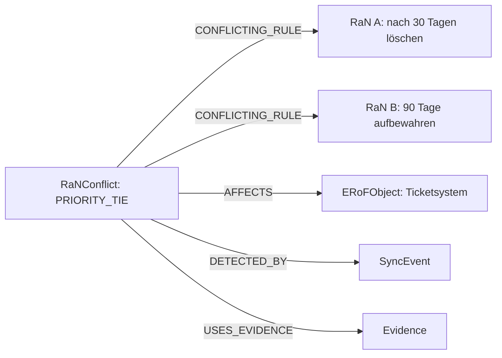

`UNEVALUABLE` ist der zweite Konflikttyp und kann bereits eine nicht eindeutig auswertbare Regel betreffen. `PRIORITY_TIE` benötigt mindestens zwei `CONFLICTING_RULE`-Kanten. Erst eine ausdrückliche fachliche Änderung und ein nachfolgender erfolgreicher Lauf dürfen den Konflikt von `OPEN` auf `RESOLVED` setzen; sein offener Zustand wird dabei als `PiH` historisiert.

Der anschließend gelöste Zustand besitzt zusätzlich:

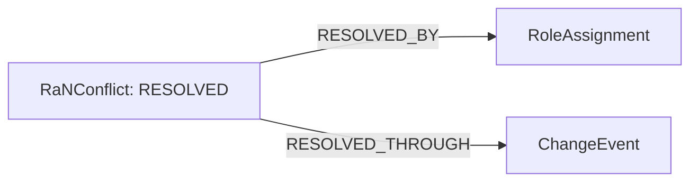

## 9. Änderung und SYNC

Später soll die Antwortzeit von 24 auf 12 Stunden verkürzt werden. Anna beantragt die Änderung an einem bereits vorhandenen `PiF1o`:

```text
PiF1o      ── CHANGED_BY ───► ChangeEvent
ChangeEvent ── REQUESTED_BY ──► RoleAssignment: Anna
```

Weil der Zielknoten bereits existiert, verweist er über `CHANGED_BY` auf das angenommene `ChangeEvent`. Direkt nach der Annahme kann dieses Ereignis noch `TRIGGERS = 0` besitzen: Der Auftrag wartet dann auf den Abschluss seines ersten technischen Versuchs.

`SYNC` ist die gespeicherte und historisierbare Prozessdefinition. `SyncRun` ist der veränderbare technische Laufzustand und kein Graphknoten. Jeder Versuch besitzt eine eindeutige `runId`. `SyncEvent` wird erst nach Abschluss oder kontrolliertem Abbruch unveränderlich gespeichert.

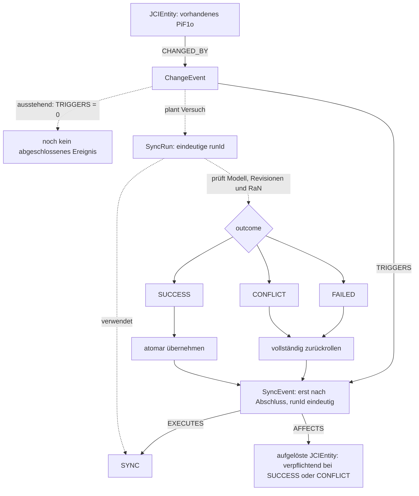

Gestrichelte Pfeile sind technische Prozessschritte, keine gespeicherten Beziehungen. Jeder beendete oder kontrolliert abgebrochene Versuch erzeugt genau ein eigenes `SyncEvent` mit derselben `runId` wie sein `SyncRun`. Ein Wiederholungsversuch erzeugt eine neue `runId`, ein neues `SyncEvent` und eine weitere append-only ergänzte `TRIGGERS`-Beziehung.

## 10. Die drei SYNC-Ausgänge

| Ausgang    | Fachliche Änderung            | Revision und `PiH`                                | Abschlussdokumentation                                                                                                |
| ---------- | ----------------------------- | ------------------------------------------------- | --------------------------------------------------------------------------------------------------------------------- |
| `SUCCESS`  | vollständig atomar übernehmen | für jede tatsächlich geänderte vorhandene Entität | `SyncEvent`; mindestens ein `AFFECTS`-Ziel                                                                            |
| `CONFLICT` | vollständig zurückrollen      | nicht für abgewiesene Zustände                    | `SyncEvent`; mindestens ein `AFFECTS`-Ziel, gegebenenfalls `RaNConflict`                                              |
| `FAILED`   | vollständig zurückrollen      | nicht für abgewiesene Zustände                    | `SyncEvent` sofort oder nach technischer Wiederherstellung; `AFFECTS` darf nur vor erfolgreicher Zielauflösung fehlen |

Das abgeschlossene Ereignis dokumentiert die verwendete Definition und alle betroffenen Entitäten:

```text
ChangeEvent ── TRIGGERS ──► SyncEvent: erst nach Abschluss, `runId` eindeutig
SyncEvent ── EXECUTES ─────► SYNC
SyncEvent ── AFFECTS ──────► JCIEntity
```

Bei `SUCCESS` werden nur tatsächlich abgelöste Zustände historisiert:

```text
PiF1o    ── HAS_HISTORICAL_STATE ──► PiH: PiF1o Revision 3
SyncEvent ── CREATES_HISTORY ───────► PiH: PiF1o Revision 3
```

Wird auch das `SuccessCriterion` geändert, erhält es ein eigenes `PiH`. Ein nur geprüftes, unverändertes `Task` erhält keines.

Für das erstmalige Anlegen einer Entität gilt eine andere Provenienz. Bei einem `ChangeEvent` mit `changeType = CREATED` existiert vor dem erfolgreichen Commit noch kein Zielknoten und deshalb auch keine `CHANGED_BY`-Quelle. Bei `SUCCESS` entstehen der neue Knoten mit `revision = 1`, sein `CREATED_BY` und genau ein `CHANGED_BY` gemeinsam; ein `PiH` entsteht mangels Vorgängerzustand nicht. Bei `CONFLICT` oder `FAILED` bleiben Zielknoten, `CHANGED_BY` und Historie aus.

## 11. HistoricalCorrection

Ein Fehler in einem vorhandenen `PiH` wird niemals durch Überschreiben berichtigt:

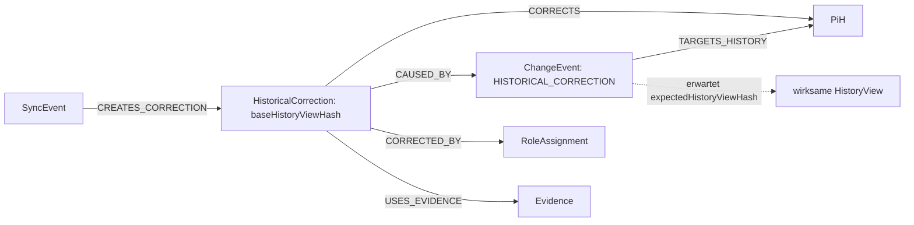

Vor dem Commit berechnet `SYNC` die wirksame `HistoryView` aus dem unveränderten `PiH` und seinen aktiven Korrekturen. Nur wenn deren aktueller Hash mit `expectedHistoryViewHash` des Auftrags übereinstimmt, darf die neue Korrektur mit demselben Wert als `baseHistoryViewHash` entstehen. Die Verarbeitung wird je `PiH` serialisiert; ein veralteter Hash führt zu `CONFLICT` und erzeugt keine Korrektur.

Zwei aktive `HistoricalCorrections` desselben `PiH` dürfen parallel bestehen, wenn ihre `correctedFields` disjunkt sind, beispielsweise `/stateData/name` und `/relationshipData/HAS_MEMBER:OUT:team-7/validUntil`. Überschneiden sich die Felder, muss die neue Korrektur genau eine aktive Vorgängerkorrektur über `SUPERSEDES` vollständig ersetzen und alle weiterhin gültigen Werte übernehmen. Unklare oder mehrfache Überlappungen führen zu `CONFLICT`. Das ursprüngliche `PiH` und alle Korrekturen bleiben unveränderlich.

## 12. Vollständige Rückverfolgung

| Perspektive           | Pfad beziehungsweise Frage                                                                                            |
| --------------------- | --------------------------------------------------------------------------------------------------------------------- |
| **WHY**               | Vom `Task` über `PiF1o`, `PiF1t`, `PiF1s` und `PiF2` zu `CiV`: Warum existiert die Arbeit?                            |
| **WHO**               | Vom `Task` über `RoleAssignment`, `RoFTeamMember`, `RoFRole`, `RoFTeam` und `RoFOrg`: Wer handelt in welchem Kontext? |
| **WHERE**             | Von `Task` und `RoleAssignment` über `USES` zu `ERoFObject` und dessen `OWNED_BY`: Welche Umwelt wird verwendet?      |
| **UNDER WHICH RULES** | Invers von einem Ziel zu den über `GOVERNS` verbundenen `RaN`: Welche Regeln gelten?                                  |
| **WITH WHAT RESULT**  | Von `Task` zu `Result`, `Verification`, `SuccessCriterion` und `Evidence`: Was entstand und wie wurde es geprüft?     |
| **WITH WHAT HISTORY** | Von `JCIEntity` und `SyncEvent` zu `PiH` und `HistoricalCorrection`: Welche Zustände und Berichtigungen bestehen?     |

## 13. Abdeckung aller konkreten Entitäten

Die Gesamtkarte zeigt jeden konkreten Entitätstyp mindestens einmal. Sie fasst mögliche Beziehungen zusammen; bedingte Kanten wie `CHANGED_BY`, `TARGETS_HISTORY` und `AFFECTS` müssen nicht gemeinsam in demselben Veränderungsvorgang vorkommen. Detailregeln und Kardinalitäten bleiben in den vorangehenden kleineren Grafiken und der kanonischen Spezifikation beschrieben.

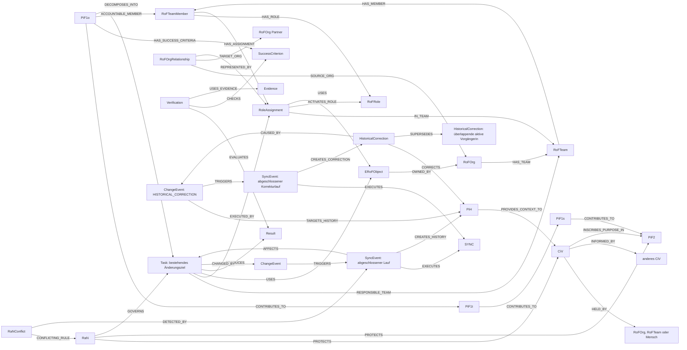

| Bereich              | Entitäten                                                                               |
| -------------------- | --------------------------------------------------------------------------------------- |
| Kernelementinstanzen | `PiH`, `CiV`, `RaN`, `SYNC`, `PiF2`, `PiF1s`, `PiF1t`, `PiF1o`                          |
| Organisation         | `RoFOrg`, `RoFOrgRelationship`, `RoFTeam`, `RoFTeamMember`, `RoFRole`, `RoleAssignment` |
| Arbeit und Prüfung   | `Task`, `SuccessCriterion`, `Result`, `Verification`, `Evidence`, `ERoFObject`          |
| Veränderung          | `ChangeEvent`, `SyncEvent`, `RaNConflict`, `HistoricalCorrection`                       |

`JCIEntity`, `JCIElementInstance` und `GraphObject` sind abstrakte Typen. `RoF` und `ERoF` sind Modellräume. `SyncRun` ist technischer Laufzustand. Sie werden deshalb nicht als zusätzliche fachliche Knoten gezählt.
