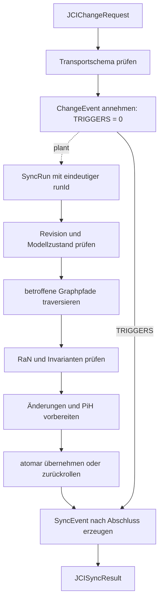

# JCI-Implementierungsleitfaden

[Dokumentationsübersicht](../README.md) · [English](../en/guides/JCI_IMPLEMENTATION_GUIDE.md)

## Zweck

Dieser Leitfaden ordnet die Implementierungsschritte ein. Verbindlich bleiben `JCI_CONTEXT.md`, `JCI_ONTOLOGY.md`, `JCI_GRAPH_RULES.md` und `JCI_SYNC_SPEC.md`.

## 1. Einmaligen Bootstrap ausführen

Der Bootstrap ist ausschließlich für einen vollständig leeren Graphen vorgesehen. Eine einzige atomare Transaktion erzeugt eine `RoFOrg`, ein `RoFTeam`, ein technisches `RoFTeamMember`, eine `RoFRole`, genau ein Root-`RoleAssignment` mit `bootstrapKey = "ROOT"` und eine `SYNC`-Definition. Alle sechs Entitäten erhalten unmittelbar `status = ACTIVE`, `revision = 1` sowie denselben Wert für `createdAt` und `updatedAt`; vorhandene `validFrom`-Werte entsprechen demselben Bootstrapzeitpunkt. Nur das Root-`RoleAssignment` darf ohne `CREATED_BY` bestehen; alle weiteren Bootstrap-Entitäten verweisen mit `CREATED_BY` auf das Root-`RoleAssignment`.

Vor dem Commit sind der leere Ausgangsgraph, die Vollständigkeit des Minimalgraphen und die Eindeutigkeit von `bootstrapKey = "ROOT"` zu prüfen. Bei einem Fehler wird alles zurückgerollt. Der Bootstrap erzeugt kein `ChangeEvent`, keinen `SyncRun`, kein `SyncEvent` und kein `PiH`; nach dem erfolgreichen Commit sind eine Wiederholung und ein zweites Root-`RoleAssignment` verboten. Ein Import ist kein Bootstrap und durchläuft später den regulären SYNC-Prozess.

## 2. Entitäten speichern

Jeder Knoten erhält den abstrakten Typ `JCIEntity` und genau einen konkreten `entityType`. Gemeinsame Pflichtfelder sind UUID, Name, Zeitangaben, positive Revision und typgerechter Status. Neu erzeugte Entitäten beginnen mit `revision = 1`. `RoF` und `ERoF` werden nicht als eigene Knoten angelegt.

Eine `Verification` speichert zusätzlich `evaluatedResultRevision` und `checkedCriterionRevision`. Sie ist nur anwendbar, wenn sie nicht ersetzt wurde und beide gebundenen Revisionen den aktuellen Revisionen ihres `Result` und `SuccessCriterion` entsprechen. Beispiel: Ändert sich ein Kriterium von Revision 2 auf 3, darf eine auf Revision 2 gebundene Prüfung nicht mehr zur aktuellen Zielerreichung beitragen.

## 3. Beziehungen validieren

Nur kanonische Beziehungstypen sind zulässig. Vor Aktivierung werden Richtung, Endpunkttypen, Kardinalitäten, zeitliche Gültigkeit und zusätzliche Invarianten geprüft. Inverse Lesarten erzeugen keine zweite Kante.

## 4. Änderungsauftrag annehmen

Ein Auftrag wird gegen `schemas/jci-change-request.schema.json` geprüft. Das Schema kontrolliert Transportform und Datentypen. Nach der Annahme wird das `ChangeEvent` eindeutig gespeichert und ein technischer Versuch eingeplant. Bis ein Versuch abgeschlossen ist, darf das `ChangeEvent` noch keine `TRIGGERS`-Beziehung besitzen.

Die Provenienz hängt vom Änderungstyp ab:

- Bei einer Änderung einer vorhandenen Entität verweist diese über `CHANGED_BY` auf das `ChangeEvent`.
- Bei `CREATED` gibt es zunächst weder Zielknoten noch `CHANGED_BY`. Nur ein erfolgreicher Commit erzeugt den Knoten mit `revision = 1`, `CREATED_BY` und `CHANGED_BY`; ein `PiH` entsteht nicht.
- Bei `HISTORICAL_CORRECTION` besitzt das `ChangeEvent` keine `CHANGED_BY`-Quelle, sondern genau ein `TARGETS_HISTORY` zum unveränderten `PiH`.

Erst danach prüft `SYNC` Status, Graphstruktur, `RaN`, Revision und Rückverfolgbarkeit.

## 5. SYNC ausführen

Ein `SyncRun` ist technischer Laufzustand und kein Graphknoten. Das `SyncEvent` wird erst nach Abschluss oder kontrolliertem Abbruch erzeugt und übernimmt genau dessen eindeutige `runId`. Jeder weitere Versuch erhält eine neue `runId`, ein eigenes `SyncEvent` und eine weitere append-only ergänzte `TRIGGERS`-Beziehung. Bei `CONFLICT` oder `FAILED` werden fachliche Änderungen zurückgerollt; die Abschlussdokumentation bleibt erhalten beziehungsweise wird nachgeholt.

Für `AFFECTS` gilt: `SUCCESS` und `CONFLICT` dokumentieren mindestens eine aufgelöste betroffene `JCIEntity`. Nur ein `FAILED`-Versuch, der bereits vor erfolgreicher Zielauflösung endet, darf kein `AFFECTS` besitzen.

## 6. Historisieren

Vor jeder tatsächlich übernommenen Änderung einer vorhandenen Entität wird der vollständige bisherige Zustand einschließlich gültiger Beziehungen als unveränderliches `PiH` vorbereitet. Neue Entitäten beginnen mit Revision 1 und erhalten kein `PiH`, weil noch kein Vorgängerzustand existiert. Ein vorhandenes `PiH` wird niemals überschrieben oder erneut historisiert, sondern nur durch ein neues `HistoricalCorrection` berichtigt.

Ein Korrekturauftrag übermittelt `expectedHistoryViewHash` und lexikografisch sortierte, eindeutige `correctedFields`. Unmittelbar vor dem Commit berechnet `SYNC` die aktuelle wirksame `HistoryView`, vergleicht ihren Hash und serialisiert den Commit je `PiH`. Ein abweichender Hash erzeugt `CONFLICT`. Mehrere aktive Korrekturen dürfen nur disjunkte Felder betreffen. Bei einer Überschneidung muss die neue Korrektur genau eine aktive Vorgängerkorrektur über `SUPERSEDES` vollständig ersetzen und deren weiterhin gültige Werte übernehmen; unklare oder mehrfache Überschneidungen erzeugen ebenfalls `CONFLICT`.

## 7. Austausch und Export

- Eingabe: `JCIChangeRequest`
- Ausgabe: `JCISyncResult`
- vollständiger Graph: JSON-LD 1.1
- öffentlicher Namespace: `https://eeimicke.github.io/junaco-jci-loop/ns/jci/1.0#`

## 8. Empfohlene Prüfungsreihenfolge

1. Bootstrap-Bedingungen oder reguläre Anforderungsprovenienz
2. Schema und Pflichtfelder
3. ID, Typ, erwartete Revision und Statusübergang
4. Beziehungstypen und Kardinalitäten einschließlich bedingter `CHANGED_BY`- und `AFFECTS`-Kanten
5. WHY-, WHO- und Umweltpfade
6. Zielrevisionen und Anwendbarkeit von `Verification`
7. Task- und Zukunftsaggregation
8. anwendbare `RaN`, Priorität und Konflikte
9. vorbereitete Revisionen und `PiH` beziehungsweise Hash und Feldkonflikte einer historischen Korrektur
10. atomare Übernahme oder vollständiges Zurückrollen
11. unveränderliches `SyncEvent` mit eindeutiger `runId`
12. Zählwerte und Ergebnisdokument

## 9. Tests

Die vorhandenen Python-Tests prüfen zentrale Modellregeln und Dokumentkonsistenz. Eine konkrete Datenbankimplementierung benötigt zusätzlich Integrations-, Migrations-, Nebenläufigkeits-, Rollback- und Wiederanlauftests. Besonders zu testen sind der einmalige atomare Bootstrap, der ausstehende Zustand `TRIGGERS = 0`, genau ein `SyncEvent` je `runId`, die bedingten Kanten bei `CREATED` und frühem `FAILED`, revisionsveraltete Verifications sowie konkurrierende historische Korrekturen mit gleichem und überlappendem `HistoryView`-Stand.

