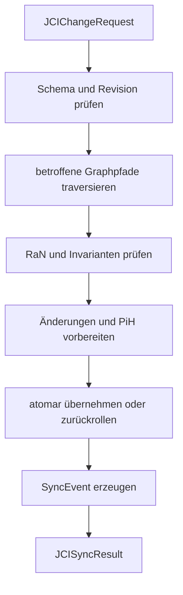

# JCI-Implementierungsleitfaden

[Dokumentationsübersicht](../README.md) · [English](../en/guides/JCI_IMPLEMENTATION_GUIDE.md)

## Zweck

Dieser Leitfaden ordnet die Implementierungsschritte ein. Verbindlich bleiben `JCI_CONTEXT.md`, `JCI_ONTOLOGY.md`, `JCI_GRAPH_RULES.md` und `JCI_SYNC_SPEC.md`.

## 1. Entitäten speichern

Jeder Knoten erhält den abstrakten Typ `JCIEntity` und genau einen konkreten `entityType`. Gemeinsame Pflichtfelder sind UUID, Name, Zeitangaben, positive Revision und typgerechter Status. `RoF` und `ERoF` werden nicht als eigene Knoten angelegt.

## 2. Beziehungen validieren

Nur kanonische Beziehungstypen sind zulässig. Vor Aktivierung werden Richtung, Endpunkttypen, Kardinalitäten, zeitliche Gültigkeit und zusätzliche Invarianten geprüft. Inverse Lesarten erzeugen keine zweite Kante.

## 3. Änderungsauftrag annehmen

Ein Auftrag wird gegen `schemas/jci-change-request.schema.json` geprüft. Das Schema kontrolliert Transportform und Datentypen. Erst danach prüft `SYNC` Status, Graphstruktur, `RaN`, Revision und Rückverfolgbarkeit.

## 4. SYNC ausführen

Ein `SyncRun` ist technischer Laufzustand und kein Graphknoten. Das `SyncEvent` wird erst nach Abschluss oder kontrolliertem Abbruch erzeugt. Bei `CONFLICT` oder `FAILED` werden fachliche Änderungen zurückgerollt; die Abschlussdokumentation bleibt erhalten beziehungsweise wird nachgeholt.

## 5. Historisieren

Vor jeder tatsächlich übernommenen Änderung wird der vollständige bisherige Zustand einschließlich gültiger Beziehungen als unveränderliches `PiH` vorbereitet. Neue Entitäten beginnen mit Revision 1 und erhalten noch kein `PiH`. Ein vorhandenes `PiH` wird nur durch ein neues `HistoricalCorrection` berichtigt.

## 6. Austausch und Export

- Eingabe: `JCIChangeRequest`
- Ausgabe: `JCISyncResult`
- vollständiger Graph: JSON-LD 1.1
- öffentlicher Namespace: `https://eeimicke.github.io/junaco-jci-loop/ns/jci/1.0#`

## 7. Empfohlene Prüfungsreihenfolge

1. Schema und Pflichtfelder
2. ID, Typ, erwartete Revision und Statusübergang
3. Beziehungstypen und Kardinalitäten
4. WHY-, WHO- und Umweltpfade
5. Task- und Zukunftsaggregation
6. anwendbare `RaN`, Priorität und Konflikte
7. vorbereitete Revisionen und `PiH`
8. atomare Übernahme
9. unveränderliches `SyncEvent`
10. Zählwerte und Ergebnisdokument

## 8. Tests

Die vorhandenen Python-Tests prüfen zentrale Modellregeln und Dokumentkonsistenz. Eine konkrete Datenbankimplementierung benötigt zusätzlich Integrations-, Migrations-, Nebenläufigkeits-, Rollback- und Wiederanlauftests.

