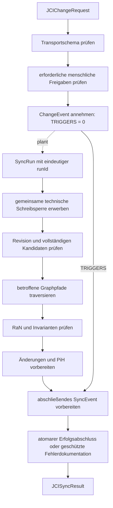

# JCI-Implementierungsleitfaden

[Dokumentationsübersicht](../README.md) · [English](../en/guides/JCI_IMPLEMENTATION_GUIDE.md)

## Zweck

Dieser Leitfaden ordnet die Implementierungsschritte ein. Verbindlich bleiben [`JCI_CONTEXT.md`](../JCI_CONTEXT.md), [`JCI_ONTOLOGY.md`](../JCI_ONTOLOGY.md), [`JCI_GRAPH_RULES.md`](../JCI_GRAPH_RULES.md) und [`JCI_SYNC_SPEC.md`](../JCI_SYNC_SPEC.md).

## 1. Einmaligen Bootstrap ausführen

Der Bootstrap ist ausschließlich für einen vollständig leeren Graphen vorgesehen. Eine einzige atomare Transaktion erzeugt eine `RoFOrg`, ein `RoFTeam`, ein technisches `RoFTeamMember`, eine `RoFRole`, genau ein Root-`RoleAssignment` mit `bootstrapKey = "ROOT"` und eine `SYNC`-Definition. Alle sechs Entitäten erhalten unmittelbar `status = ACTIVE`, `revision = 1` sowie denselben Wert für `createdAt` und `updatedAt`; vorhandene `validFrom`-Werte entsprechen demselben Bootstrapzeitpunkt. Nur das Root-`RoleAssignment` darf ohne `CREATED_BY` bestehen; alle weiteren Bootstrap-Entitäten verweisen mit `CREATED_BY` auf das Root-`RoleAssignment`.

Vor dem Commit sind der leere Ausgangsgraph, die Vollständigkeit des Minimalgraphen und die Eindeutigkeit von `bootstrapKey = "ROOT"` zu prüfen. Bei einem Fehler wird alles zurückgerollt. Der Bootstrap erzeugt kein `ChangeEvent`, keinen `SyncRun`, kein `SyncEvent` und kein `PiH`; nach dem erfolgreichen Commit sind eine Wiederholung und ein zweites Root-`RoleAssignment` verboten. Ein Import ist kein Bootstrap und durchläuft später den regulären SYNC-Prozess.

## 2. Entitäten speichern

Jeder Knoten erhält den abstrakten Typ `JCIEntity` und genau einen konkreten `entityType`. Gemeinsame Pflichtfelder sind UUID, Name, Zeitangaben, positive Revision und typgerechter Status. Neu erzeugte Entitäten beginnen mit `revision = 1`. `RoF` und `ERoF` werden nicht als eigene Knoten angelegt.

Ein `CiV` speichert genau einen Wert mit den Pflichtfeldern `notCiV`, `selfCiV` und `toServeCiV`. Sein Scope ist ausschließlich die eine `HELD_BY`-Beziehung zu `RoFOrg`, `RoFTeam` oder einem menschlichen `RoFTeamMember`; `purpose`, `values` und `scope` werden am CiV nicht gespeichert. `INFORMED_BY` dokumentiert nur ausdrücklich bestätigte Herkunft. Alle ein `PiF2` unmittelbar begründenden CiV müssen denselben Werteträger besitzen.

Eine `Verification` speichert zusätzlich `evaluatedResultRevision` und `checkedCriterionRevision`. Sie ist nur anwendbar, wenn sie nicht ersetzt wurde und beide gebundenen Revisionen den aktuellen Revisionen ihres `Result` und `SuccessCriterion` entsprechen. Beispiel: Ändert sich ein Kriterium von Revision 2 auf 3, darf eine auf Revision 2 gebundene Prüfung nicht mehr zur aktuellen Zielerreichung beitragen.

## 3. Beziehungen validieren

Nur kanonische Beziehungstypen sind zulässig. Vor Aktivierung werden Richtung, Endpunkttypen, Kardinalitäten, zeitliche Gültigkeit und zusätzliche Invarianten geprüft. Inverse Lesarten erzeugen keine zweite Kante.

Ein aktives `RaN` besitzt mindestens ein `PROTECTS` zu `CiV`, mindestens ein `PROTECTS` zu einem von diesem CiV begründeten `PiF2` und mindestens ein `GOVERNS` zu einem zulässigen Umsetzungselement. Zulässige Umsetzungstypen umfassen die Zukunftsebenen `PiF1s` bis `PiF1o`, Arbeit, Erfolg und Prüfung, Organisation, Rollen und Umwelt. `PiF2` ist kein `GOVERNS`-Ziel. Schutzbeziehungen werden nur nach menschlicher Bestätigung gespeichert und nicht durch `SYNC` abgeleitet.

Bei der Migration einer bestehenden `GOVERNS`-Kante zu `PiF2` wird zunächst ein `PROTECTS`-Kandidat zum PiF2 vorbereitet. Ein berechtigtes `RoleAssignment` bestätigt mindestens ein durch dieses PiF2 verbundenes CiV als ebenfalls geschützt und verbindet die konkreten Umsetzungselemente über `GOVERNS`. Erst nach erfolgreicher SYNC-Prüfung wird die alte Kante entfernt. Eine automatische CiV-Auswahl ist unzulässig.

### 3.1 Zustandsverantwortung und aktuelle Mengen

Der versionierte Beziehungskatalog bestimmt für jeden Beziehungskontext, welcher Endpunkt fachlich geändert wird. Neue `EVALUATES`, `CHECKS`, `USES_EVIDENCE` und `SUPERSEDES` einer Verification verändern deren referenzierte Ziele nicht. Neue Ereignis- und Historienbezüge erzeugen ebenfalls keine Revision der bloß referenzierten Fachentität. Echte Änderungen am zugeordneten Fachzustand erzeugen je vorhandener veränderlicher Entität genau eine Revision und ein PiH. Unklassifizierte Beziehungen werden nicht als revisionsneutral angenommen.

Für PiF1o werden Tasks und Kriterien in `REPLACED` oder `REVOKED` aus der aktuellen Auswertung ausgeschlossen, ihre gespeicherten Herkunftsbeziehungen bleiben bestehen. `COMPLETED` zählt weiterhin. Mindestens ein aktueller Task und ein aktuelles `REQUIRED`-Kriterium sind erforderlich. Aufhebungen, Nachfolger und Nachkommen brauchen einen bestätigten gültigen Umfang; alte `DEPENDS_ON`-Verweise werden nicht automatisch umgebogen. Results nicht mehr berücksichtigter Tasks zählen nicht stillschweigend zur Zielerreichung.

### 3.2 Gemeinsame Abschlussauswertung

Eigene unerfüllte Voraussetzungen eines freigegebenen Composite haben Vorrang und ergeben `BLOCKED`. Danach wird sein aktueller Kinderumfang ausgewertet. Bei nur noch `DRAFT`-Kindern bleibt ein freigegebener Composite `ACTIVE`; `DRAFT` benötigt zuerst eine reguläre Freigabe und wird durch Umfangsreduktion nicht direkt `COMPLETED`.

Vor dieser Auswertung wird ein gemeinsamer Abschlussgraph aus Composite-zu-Kind und `DEPENDS_ON` gebildet. Ein gemischter Zyklus erzeugt `CONFLICT`. Die Reihenfolge folgt den Voraussetzungen zuerst und mischt atomare und zusammengesetzte Tasks. Erst anschließend werden aktuelle Pflichtkriterien, Zielerreichung und höhere Zukunftsbeiträge ausgewertet.

### 3.3 Menschliche Freigaben implementieren

Freigabepflichtige Vorgänge verwenden zusätzlich `approvalProfileVersion = "1.0"`. Die gespeicherte `SYNC.definition` muss dieses Profil ausdrücklich unterstützen, `APPROVED_BY` im Beziehungskatalog führen und das passende Prüfmodul über die Paketprüfsumme binden. Der Basisauftrag und sein kanonisches Hashprofil bleiben `2.0`; ein älterer Handler darf das zusätzliche Profil nicht ignorieren.

`ACCOUNTABLE_MEMBER` bleibt für `PiF1o` genau `1`; auf `PiF1t`, `PiF1s` und `PiF2` gilt jeweils `0..1`. Eine tatsächlich benötigte Freigabeebene muss eindeutig besetzt sein. Accountability, `CONTRIBUTES_TO` und Rollennamen erteilen keine Befugnis. Diese benötigt eine aktive, zeitlich gültige, scope-passende `PERMIT`-RaN mit passender `condition`, `decisionKey` und optionalem strukturiertem Feld:

```text
approvalPolicy = {
  profileVersion: "1.0",
  mode: ACCOUNTABLE_CHAIN | VALUE_SCOPE,
  roleIds: nicht leere, eindeutige Liste von RoFRole-UUIDs,
  levels: bei ACCOUNTABLE_CHAIN nicht leere Liste aus PiF1o, PiF1t, PiF1s, PiF2;
          bei VALUE_SCOPE nicht gesetzt oder leer
}
```

Für `Task.action.RELEASE` beginnt `ACCOUNTABLE_CHAIN` beim direkt zugeordneten `PiF1o`. Fehlt ausschließlich die Befugnis, werden sämtliche aktuellen Beitragszweige bis zur ersten befugten Accountability je Zweig verfolgt, höchstens bis `PiF2`. Alle erforderlichen Anker müssen genehmigt sein, unabhängig von `contributionMode`. Fehlende Zuordnungen, `UNEVALUABLE`, wirksames `DENY` und menschliche Ablehnung erlauben kein Überspringen oder Ausweichen auf andere Rollen.

Für `Model.action.CONFIRM` prüft `VALUE_SCOPE` alle betroffenen alten und neuen Werteträger bei CiV-, Herkunfts-, Zweck-, Schutz-, Policy- und Accountability-Änderungen. Die erlaubende Policy muss den jeweiligen Werteträger über ihre geschützten CiV/PiF2 abdecken; `GLOBAL` erweitert dieses Mandat nicht. Zusätzlich gelten Rollenoperand, Akteurszugehörigkeit und `APPLIES_IN`. Ausgewertet wird die geregelte `RoleAssignment`, nicht ein neues `GOVERNS` zu `CiV` oder `PiF2`. Maßgeblich ist die vor der Änderung gültige Befugnis; der Kandidat darf sich nicht selbst autorisieren.

Der [Freigabe-Envelope](../schemas/jci-approval-envelope.schema.json) enthält den unveränderten `proposal`, `decisionKey`, `requestHash`, `contextHash` und `receipts`. Vorschläge und auch abgelehnte Belege bleiben dauerhaft technischer Workflowzustand außerhalb von `JCIEntity`. Eine vertrauenswürdige Integration muss die authentifizierte Antragstellerrolle sowie den zustimmenden Menschen hinter `memberId` und `roleAssignmentId` nachweisen. Der Beleg bindet den exakten Auftrag, Kontext und Gültigkeitszeitraum; eine selbst gesetzte Bestätigungsvariable ist kein Nachweis.

Erst die vollständige Genehmigung erzeugt das angenommene `ChangeEvent` mit unverändertem `REQUESTED_BY` und den source-owned `APPROVED_BY`-Kanten. Jede Kante trägt `receiptId`, `decidedAt`, `requestHash` und `approvalHash`, gehört ausschließlich zum neuen Ereignis und bleibt unveränderlich; die referenzierte Rollenaktivierung erhält dadurch keine Revision. Generische `CONNECT`-Operationen dürfen solche Belege nicht vortäuschen. Annahme und abschließender Commit prüfen Identität, sämtliche erforderlichen Belege, Route, Policy, Revisionen und Zeitgültigkeit erneut unter dem gemeinsamen Gate.

Eine ausdrücklich eingerichtete Anfangsbefugnis darf vor der ersten passenden Policy genau einen nachgewiesenen Menschen, seine Rollenaktivierung und einen Werteträger für `Model.action.CONFIRM` verbinden. Sie ist niemals eine Task-Freigabe oder automatische Root-Befugnis. Die erste Aktivierung einer `VALUE_SCOPE`-Policy für diesen Werteträger setzt atomar einen dauerhaften Sperrmerker; späterer Widerruf aktiviert die Anfangsbefugnis nicht wieder.

Die [Freigabereferenz](../../reference/jci_approval.py) trennt Registrierung, unveränderliche Antwortbelege, Annahme und Commit. `release_with_approval` bindet die Task-Prüfsicht an den signierten Graphen und verlangt zusätzlich eine vollständige Kandidatenvalidierung für WHY, WHO, Abhängigkeiten, RaN und ERoF. Eine Genehmigung führt erst nach erfolgreichem `SYNC` zu `ACTIVE` oder `BLOCKED`, niemals unmittelbar zu `COMPLETED` oder `ACHIEVED`. Fehlende oder abgelehnte Genehmigungen verändern keinen Task. Die Referenz benötigt reale Authentifizierungs-, Persistenz- und Transaktionsadapter; sie ist keine produktive Freigabe-Engine.

## 4. Änderungsauftrag annehmen

Ein Auftrag wird gegen [`schemas/jci-change-request.schema.json`](../schemas/jci-change-request.schema.json) geprüft. Das Schema kontrolliert Transportform und Datentypen. Nach der Annahme wird das `ChangeEvent` eindeutig gespeichert und ein technischer Versuch eingeplant. Bis ein Versuch abgeschlossen ist, darf das `ChangeEvent` noch keine `TRIGGERS`-Beziehung besitzen.

Bei freigabepflichtigen Vorgängen ist dies der innere Basisauftrag des Envelopes aus Abschnitt 3.3. Solange die vollständige menschliche Genehmigung fehlt, besteht ausschließlich der technische Vorschlag, noch kein angenommenes Ereignis. Freigabe-Envelopes werden nicht nachträglich an ein bereits unveränderliches `ChangeEvent` angehängt.

Die Provenienz hängt vom Änderungstyp ab:

- Bei einer Änderung einer vorhandenen Entität verweist diese über `CHANGED_BY` auf das `ChangeEvent`.
- Bei `CREATED` gibt es zunächst weder Zielknoten noch `CHANGED_BY`. Nur ein erfolgreicher Commit erzeugt den Knoten mit `revision = 1`, `CREATED_BY` und `CHANGED_BY`; für diesen neuen Knoten entsteht kein `PiH`. Ändert seine Einbindung den zugeordneten fachlichen Zustand vorhandener Strukturendpunkte, erhalten diese jeweils eine Revision und ein `PiH`.
- Bei `HISTORICAL_CORRECTION` besitzt das `ChangeEvent` keine `CHANGED_BY`-Quelle, sondern genau ein `TARGETS_HISTORY` zum unveränderten `PiH`.

Erst danach prüft `SYNC` Status, Graphstruktur, `RaN`, Revision und Rückverfolgbarkeit.

Der vollständige normalisierte Request wird unveränderlich an `requestId` und `idempotencyKey` gebunden. Derselbe Schlüssel mit anderem Inhalt wird abgewiesen. Die Übernahme einer fachlichen Änderung darf auch nach verlorener Antwort nicht wiederholt werden.

## 5. SYNC ausführen



Die Referenzarchitektur serialisiert alle JCI-Schreibwege am gemeinsamen Modellbestand über eine technische Datenbanksperre. Unter dieser Sperre werden Request, Zielrevision, Regeln, Rollen, Prüfungsmenge, Beziehungen und relevante Abwesenheiten frisch gelesen. Der vollständige Kandidat wird geprüft; ein serverseitiger fachlicher Entscheidungszeitpunkt bestimmt die Zeitgültigkeit. Die Sperre bleibt bis Commit oder Rollback bestehen. Sie umfasst auch neue Prüfungen, Ereignisbezüge, Migrationen und historische Korrekturen, unabhängig von fachlichen Revisionserhöhungen. Der technische Sperrknoten ist keine JCIEntity.

Ein Lock nur auf bekannten Zielknoten schützt nicht vor neu hinzukommenden Regeln oder Beziehungen. Run-Besitz, Idempotenz und Wiederanlauf müssen außerdem ausschließen, dass ein veralteter Worker übernimmt. Diese Datenbankgarantien werden von den reinen Referenzfunktionen nicht implementiert.

Ein `SyncRun` ist technischer Laufzustand und kein Graphknoten. Das `SyncEvent` wird erst nach Abschluss oder kontrolliertem Abbruch erzeugt und übernimmt genau dessen eindeutige `runId`. Jeder weitere Versuch erhält eine neue `runId`, ein eigenes `SyncEvent` und eine weitere append-only ergänzte `TRIGGERS`-Beziehung. Bei `CONFLICT` oder `FAILED` werden fachliche Änderungen zurückgerollt; die Abschlussdokumentation bleibt erhalten beziehungsweise wird nachgeholt.

Für `AFFECTS` gilt: `SUCCESS` und `CONFLICT` dokumentieren mindestens eine aufgelöste betroffene `JCIEntity`. Nur ein `FAILED`-Versuch, der bereits vor erfolgreicher Zielauflösung endet, darf kein `AFFECTS` besitzen.

## 6. Historisieren

Vor jeder tatsächlich übernommenen Änderung einer vorhandenen veränderlichen Entität wird ihr bisheriger Fachzustand einschließlich der ihr nach dem versionierten Beziehungskatalog zugeordneten Beziehungen als unveränderliches `PiH` vorbereitet. Neue Entitäten beginnen mit Revision 1 und erhalten kein `PiH`, weil noch kein Vorgängerzustand existiert. Ein vorhandenes `PiH` wird niemals überschrieben oder erneut historisiert, sondern nur durch ein neues `HistoricalCorrection` berichtigt.

Ein Korrekturauftrag übermittelt `expectedHistoryViewHash` und lexikografisch sortierte, eindeutige `correctedFields`. Unmittelbar vor dem Commit berechnet `SYNC` die aktuelle wirksame `HistoryView`, vergleicht ihren Hash und serialisiert den Commit je `PiH`. Ein abweichender Hash erzeugt `CONFLICT`. Mehrere aktive Korrekturen dürfen nur disjunkte Felder betreffen. Bei einer Überschneidung muss die neue Korrektur genau eine aktive Vorgängerkorrektur über `SUPERSEDES` vollständig ersetzen und deren weiterhin gültige Werte übernehmen; unklare oder mehrfache Überschneidungen erzeugen ebenfalls `CONFLICT`.

Profil 2.0 adressiert vollständige Properties unter `/stateData/properties/<property>` und Beziehungen über `/relationshipData/<direction:relationshipType:otherEntityId>`, optional ergänzt um `/properties/<property>`. Die stabile Schlüsselabbildung ist eine Auswertungssicht; `relationshipData` bleibt gespeichert eine Liste. Identitäten werden nicht unter einer bestehenden Adresse umgedeutet. Arrayindizes, Wurzeln und Pfade innerhalb von TypedValue-Werten sind unzulässig.

Gleichheit sowie Eltern-/Unterpfade überlappen nach Dekodierung der JSON-Pointer-Segmente. Bereits innerhalb eines Auftrags sind Überlappungen verboten. `ADDITION` setzt einen fehlenden Pfad voraus; ein vorhandener `NULL`-Wert gilt nicht als fehlend. Alte Werte werden bei Annahme gegen die wirksame Sicht geprüft; spätere Sichten überlagern das Original mit absoluten Werten der nicht abgelösten Korrekturen. Bestehende PiH und Hashes bleiben unverändert; ältere Profile erhalten versionierte Resolver.

## 7. Austausch und Export

- Eingabe: `JCIChangeRequest`
- Ausgabe: `JCISyncResult`
- vollständiger Graph: JSON-LD 1.1
- öffentlicher Namespace: `https://eeimicke.github.io/junaco-jci-loop/ns/jci/1.0#`

Regeln, Snapshot-, Korrekturwert- und Austauschprofil verwenden Version `2.0`. Diese Versionierung ändert weder das Exportformat JSON-LD 1.1 noch den öffentlichen Namespace. Das [Snapshot-Payloadschema](../schemas/jci-history-snapshot.schema.json) beschreibt neue historische Nutzdaten. Die alten Transportverträge bleiben unter [Legacy-Schemas 1.1](../schemas/legacy/1.1/) erhalten und werden nur mit passenden alten Profilen gelesen.

## 8. Empfohlene Prüfungsreihenfolge

1. Bootstrap-Bedingungen oder reguläre Anforderungsprovenienz
2. Schema und Pflichtfelder
3. ID, Typ, erwartete Revision und Statusübergang
4. Beziehungstypen und Kardinalitäten einschließlich bedingter `CHANGED_BY`- und `AFFECTS`-Kanten
5. CiV-Dimensionen, `HELD_BY`, `INFORMED_BY` und gemeinsamer PiF2-Scope
6. WHY-, WHO- und Umweltpfade
7. Zielrevisionen und Anwendbarkeit von `Verification`
8. aktueller Task-/Kriterienumfang, gemeinsamer Abschlussgraph, Composite-Voraussetzungen und Zukunftsaggregation
9. `PROTECTS`-Kohärenz, `GOVERNS`-Zieltypen, anwendbare `RaN`, Priorität und Konflikte
10. vorbereitete Revisionen und `PiH` beziehungsweise Hash und Feldkonflikte einer historischen Korrektur
11. endgültigen Kandidaten, Zeitbedingungen am Entscheidungspunkt und alle Ergebniszähler prüfen
12. erfolgreiches Fachdelta, PiH, SyncEvent und Commitbeleg atomar speichern; nach Rollback Fehlerdokumentation unter dem Gate speichern
13. Ergebnis erst nach bestätigter Speicherung ausgeben; unklare Ausgänge anhand der runId wiederaufnehmen

Die gesamte Reihenfolge läuft innerhalb der geschützten Entscheidungsgrundlage. Vor der Übernahme werden der endgültige Kandidat, die vollständige Prüfungsmenge und die Zeitbedingungen erneut bestätigt; eine Vorberechnung außerhalb der Sperre ist unverbindlich.

Freigabepflicht, `approvalProfileVersion`, menschliche Identität, alte/neue Wertescopes, vollständige Route und unveränderliche Belege werden zusätzlich bei Annahme und erneut am endgültigen Entscheidungspunkt geprüft. Eine bereits dauerhaft belegte erfolgreiche Wiederholung liefert das gespeicherte Ergebnis, ohne eine abgelaufene Genehmigung erneut auszuführen oder ein zweites Fachdelta zu erzeugen.

## 9. Tests

Die vorhandenen Python-Tests prüfen zentrale Modellregeln und Dokumentkonsistenz. Eine konkrete Datenbankimplementierung benötigt zusätzlich Integrations-, Migrations-, Nebenläufigkeits-, Rollback- und Wiederanlauftests. Besonders zu testen sind der einmalige atomare Bootstrap, der ausstehende Zustand `TRIGGERS = 0`, genau ein `SyncEvent` je `runId`, die bedingten Kanten bei `CREATED` und frühem `FAILED`, revisionsveraltete Verifications sowie konkurrierende historische Korrekturen mit gleichem und überlappendem `HistoryView`-Stand.

Die [Referenzfunktionen](../../reference/jci_rules.py) und die [23 Abnahmefälle](../changes/JCI_LOGIC_2_0.md) machen die Regeln überprüfbar. Referenzfunktionen sind keine produktive SYNC-Engine und implementieren keine Neo4j-Transaktionen. Erfolgreiche lokale Tests belegen deshalb keine Datenbank-Atomarität oder Wiederanlaufgarantie. Dafür bleiben reale Transaktionstests mit kontrollierten parallelen Abläufen erforderlich.

Die [Freigabetests](../../tests/test_approval_rules.py) ergänzen lokale und verzweigte Genehmigungen, fehlende Befugnis, Ablehnung, gefälschte Belege, geänderte Grundlagen, alte/neue Werteträger, Enrollment-Abschaltung und sichere Wiederholungen. Ihr Authentifizierungsadapter ist ein Testdouble, kein Nachweis einer produktiven Identitätsintegration.
