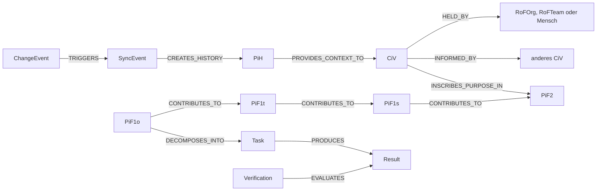

# Einführung in den JCI Loop

[Dokumentationsübersicht](../README.md) · [English](../en/guides/JCI_INTRODUCTION.md)

## Die Ausgangsthese

Organisationen scheitern selten daran, dass überhaupt keine Ziele, Rollen oder Regeln existieren. Sie scheitern häufig daran, dass diese Elemente nicht mehr zusammenpassen: Ein Ziel ändert sich, während Aufgaben, Verantwortlichkeiten, Systeme oder Regeln unverändert bleiben.

Der **JCI Loop** beschreibt diese Zusammenhänge in einem gemeinsamen Graphen und macht Veränderungen rückverfolgbar. Er beantwortet nicht nur, *was* getan wird, sondern auch *warum*, *durch wen*, *unter welchen Regeln*, *in welcher Umwelt* und *mit welchem historischen Kontext*.

## Der Zusammenhang

Jedes `CiV` beschreibt einen einzelnen Wert durch die Dimensionen NOT, SELF und TO SERVE. `HELD_BY` ordnet ihn genau einer Organisation, einem Team oder einem Menschen zu. Aus ausdrücklich ausgewählten CiV wird ein `PiF2` erarbeitet; `PiF2` bis `PiF1o` konkretisieren die gewollte Zukunft. `RaN` schützt über `PROTECTS` die CiV und PiF2 und regelt über `GOVERNS` deren konkrete Umsetzung. Tasks realisieren den operativen Zustand. Ergebnisse werden geprüft. `RoF` ordnet Verantwortung zu und `ERoF` beschreibt die relevante Umwelt. `SYNC` verfolgt Änderungen; abgelöste Zustände bleiben als `PiH` erhalten.

## Was JCI besonders macht

- **Graph statt isolierter Listen:** Beziehungen gehören zum Modell und sind nicht nur Freitext.
- **WHY-Pfad:** Von einem Task lässt sich bis zum wertbezogenen Zweck zurückgehen.
- **WHO-Pfad:** Ausführung, Team, Mitglied, Rolle und Organisation bleiben eindeutig.
- **Prüfbare Ziele:** Ein `PiF1o` besitzt Erfolgskriterien; Results und Verifications bleiben getrennt.
- **Werteschutz als Querschnitt:** `RaN` schützt CiV und PiF2 und kann in der Umsetzung konkrete Entscheidungen erlauben, verlangen oder verbieten.
- **Historisierung:** Nur tatsächlich abgelöste Zustände werden als unveränderliches `PiH` bewahrt.
- **Kontrollierte Veränderung:** `SYNC` prüft Auswirkungen, Konflikte, Revisionen und Folgeänderungen.

## Was JCI nicht ist

JCI ist keine fertige Software und kein Organigramm. Es ist ein technologieunabhängiges fachliches Modell. Eine Anwendung kann es beispielsweise in Neo4j implementieren, muss dabei aber die dokumentierten Entitäten, Beziehungen, Statusregeln und Invarianten einhalten.

## Nächster Schritt

Lies als Nächstes die [Übersicht der JCI-Elemente](JCI_ELEMENTS.md) oder verfolge das [durchgängige Beispiel](JCI_EXAMPLE.md).

